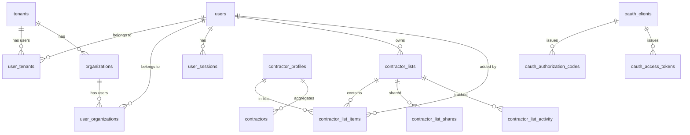

# Database Schema Documentation

## Overview

GoldenGate uses PostgreSQL as its primary database with Drizzle ORM for schema management and migrations. The database is designed with multi-tenancy, audit trails, and performance optimization in mind.

## Database Architecture



## Core Tables

### Users & Authentication

#### users
Primary user account table.

| Column | Type | Constraints | Description |
|--------|------|-------------|-------------|
| id | UUID | PRIMARY KEY | Unique user identifier |
| email | VARCHAR(255) | UNIQUE, NOT NULL | User email address |
| username | VARCHAR(50) | UNIQUE | Username for login |
| full_name | VARCHAR(255) | | User's full name |
| password_hash | TEXT | NOT NULL | Argon2 hashed password |
| is_active | BOOLEAN | DEFAULT true | Account active status |
| is_email_verified | BOOLEAN | DEFAULT false | Email verification status |
| email_verified_at | TIMESTAMP | | Email verification timestamp |
| last_login_at | TIMESTAMP | | Last login timestamp |
| created_at | TIMESTAMP | DEFAULT NOW() | Account creation date |
| updated_at | TIMESTAMP | DEFAULT NOW() | Last update timestamp |

**Indexes:**
- `idx_users_email` on (email)
- `idx_users_username` on (username)
- `idx_users_is_active` on (is_active)

#### user_sessions
Active user sessions for JWT validation.

| Column | Type | Constraints | Description |
|--------|------|-------------|-------------|
| id | UUID | PRIMARY KEY | Session identifier |
| user_id | UUID | FOREIGN KEY | References users.id |
| session_token | VARCHAR(255) | UNIQUE | Session token |
| ip_address | INET | | Client IP address |
| user_agent | TEXT | | Client user agent |
| expires_at | TIMESTAMP | NOT NULL | Session expiration |
| created_at | TIMESTAMP | DEFAULT NOW() | Session creation |

**Indexes:**
- `idx_sessions_user_id` on (user_id)
- `idx_sessions_token` on (session_token)
- `idx_sessions_expires` on (expires_at)

### Multi-Tenancy

#### tenants
Organization tenants for data isolation.

| Column | Type | Constraints | Description |
|--------|------|-------------|-------------|
| id | UUID | PRIMARY KEY | Tenant identifier |
| name | VARCHAR(255) | NOT NULL | Tenant name |
| slug | VARCHAR(100) | UNIQUE | URL-friendly identifier |
| domain | VARCHAR(255) | | Custom domain |
| settings | JSONB | DEFAULT {} | Tenant settings |
| is_active | BOOLEAN | DEFAULT true | Tenant active status |
| created_at | TIMESTAMP | DEFAULT NOW() | Creation timestamp |
| updated_at | TIMESTAMP | DEFAULT NOW() | Update timestamp |

#### user_tenants
User-tenant relationship with roles.

| Column | Type | Constraints | Description |
|--------|------|-------------|-------------|
| id | UUID | PRIMARY KEY | Relationship ID |
| user_id | UUID | FOREIGN KEY | References users.id |
| tenant_id | UUID | FOREIGN KEY | References tenants.id |
| role | VARCHAR(50) | NOT NULL | User role in tenant |
| is_default | BOOLEAN | DEFAULT false | Default tenant flag |
| joined_at | TIMESTAMP | DEFAULT NOW() | Join timestamp |
| expires_at | TIMESTAMP | | Access expiration |

**Unique Constraint:**
- `(user_id, tenant_id)` - One role per user per tenant

### Contractor Data

#### contractor_profiles
Aggregated contractor information from multiple sources.

| Column | Type | Constraints | Description |
|--------|------|-------------|-------------|
| id | UUID | PRIMARY KEY | Profile identifier |
| uei | VARCHAR(12) | UNIQUE | Unique Entity ID |
| cage_code | VARCHAR(10) | INDEX | CAGE code |
| name | VARCHAR(500) | NOT NULL | Business name |
| dba_name | VARCHAR(500) | | Doing Business As |
| legal_business_name | VARCHAR(500) | | Legal entity name |
| address_line_1 | VARCHAR(255) | | Street address |
| address_line_2 | VARCHAR(255) | | Address line 2 |
| city | VARCHAR(100) | INDEX | City |
| state | VARCHAR(2) | INDEX | State code |
| zip_code | VARCHAR(10) | | ZIP code |
| country | VARCHAR(3) | DEFAULT 'USA' | Country code |
| congressional_district | VARCHAR(10) | | Congressional district |
| business_start_date | DATE | | Business inception |
| fiscal_year_end_date | VARCHAR(5) | | Fiscal year end |
| naics_code | VARCHAR(10) | INDEX | Primary NAICS |
| naics_description | TEXT | | NAICS description |
| entity_structure | VARCHAR(100) | | Business structure |
| organization_type | VARCHAR(100) | | Organization type |
| business_types | JSONB | DEFAULT [] | Business type codes |
| employee_count | INTEGER | | Number of employees |
| annual_revenue | DECIMAL(15,2) | | Annual revenue |
| total_contract_value | DECIMAL(15,2) | | Total contracts value |
| active_contracts_count | INTEGER | DEFAULT 0 | Active contracts |
| completed_contracts_count | INTEGER | DEFAULT 0 | Completed contracts |
| average_contract_value | DECIMAL(15,2) | | Average contract value |
| certifications | JSONB | DEFAULT {} | Certifications held |
| performance_rating | DECIMAL(3,2) | | Performance score |
| capabilities | TEXT[] | | Capability statements |
| registration_date | DATE | | SAM registration date |
| registration_status | VARCHAR(50) | | Registration status |
| last_updated_date | TIMESTAMP | | Last data update |
| metadata | JSONB | DEFAULT {} | Additional metadata |

**Indexes:**
- `idx_profiles_uei` on (uei)
- `idx_profiles_name` on (name) using GIN
- `idx_profiles_state` on (state)
- `idx_profiles_naics` on (naics_code)
- `idx_profiles_business_types` on (business_types) using GIN

#### contractors
Raw contractor records from data sources.

| Column | Type | Constraints | Description |
|--------|------|-------------|-------------|
| id | UUID | PRIMARY KEY | Record identifier |
| source | VARCHAR(50) | NOT NULL | Data source |
| source_id | VARCHAR(255) | | Source record ID |
| data | JSONB | NOT NULL | Raw contractor data |
| imported_at | TIMESTAMP | DEFAULT NOW() | Import timestamp |
| updated_at | TIMESTAMP | DEFAULT NOW() | Update timestamp |

**Unique Constraint:**
- `(source, source_id)` - Prevent duplicate imports

### Portfolio Management

#### contractor_lists
User-created contractor lists/portfolios.

| Column | Type | Constraints | Description |
|--------|------|-------------|-------------|
| id | UUID | PRIMARY KEY | List identifier |
| user_id | UUID | FOREIGN KEY | Owner user ID |
| name | VARCHAR(255) | NOT NULL | List name |
| description | TEXT | | List description |
| is_default | BOOLEAN | DEFAULT false | Default/favorites list |
| is_public | BOOLEAN | DEFAULT false | Public visibility |
| color | VARCHAR(7) | | Hex color code |
| icon | VARCHAR(50) | | Icon identifier |
| sort_order | INTEGER | DEFAULT 0 | Display order |
| item_count | INTEGER | DEFAULT 0 | Number of items |
| total_value | TEXT | DEFAULT '0' | Sum of contract values |
| last_item_added_at | TIMESTAMP | | Last addition time |
| settings | JSONB | DEFAULT {} | List settings |
| created_at | TIMESTAMP | DEFAULT NOW() | Creation timestamp |
| updated_at | TIMESTAMP | DEFAULT NOW() | Update timestamp |

**Indexes:**
- `idx_list_user_id` on (user_id)
- `idx_list_is_default` on (is_default)
- `idx_list_is_public` on (is_public)

**Unique Constraint:**
- `idx_unique_default_per_user` on (user_id) WHERE is_default = true

#### contractor_list_items
Items within contractor lists.

| Column | Type | Constraints | Description |
|--------|------|-------------|-------------|
| id | UUID | PRIMARY KEY | Item identifier |
| list_id | UUID | FOREIGN KEY | Parent list ID |
| contractor_profile_id | UUID | FOREIGN KEY | Contractor profile |
| notes | TEXT | | User notes |
| tags | JSONB | DEFAULT [] | Item tags |
| rating | INTEGER | CHECK 1-5 | User rating |
| priority | VARCHAR(20) | | Priority level |
| added_by | UUID | FOREIGN KEY | User who added |
| added_at | TIMESTAMP | DEFAULT NOW() | Addition timestamp |
| last_viewed_at | TIMESTAMP | | Last view time |
| view_count | INTEGER | DEFAULT 0 | View counter |
| custom_data | JSONB | | Custom fields |

**Indexes:**
- `idx_item_list_id` on (list_id)
- `idx_item_contractor_profile_id` on (contractor_profile_id)
- `idx_item_added_by` on (added_by)

**Unique Constraint:**
- `idx_unique_contractor_per_list` on (list_id, contractor_profile_id)

#### contractor_list_shares
List sharing permissions.

| Column | Type | Constraints | Description |
|--------|------|-------------|-------------|
| id | UUID | PRIMARY KEY | Share identifier |
| list_id | UUID | FOREIGN KEY | Shared list ID |
| shared_with_user_id | UUID | FOREIGN KEY | Recipient user |
| shared_with_email | VARCHAR(255) | | External email |
| permission | VARCHAR(20) | DEFAULT 'view' | Permission level |
| shared_by | UUID | FOREIGN KEY | Sharing user |
| shared_at | TIMESTAMP | DEFAULT NOW() | Share timestamp |
| access_token | VARCHAR(255) | UNIQUE | Access token |
| expires_at | TIMESTAMP | | Expiration time |
| last_accessed_at | TIMESTAMP | | Last access time |

**Indexes:**
- `idx_share_list_id` on (list_id)
- `idx_share_shared_with_user_id` on (shared_with_user_id)
- `idx_share_access_token` on (access_token)

#### contractor_list_activity
Activity log for lists.

| Column | Type | Constraints | Description |
|--------|------|-------------|-------------|
| id | UUID | PRIMARY KEY | Activity ID |
| list_id | UUID | FOREIGN KEY | List ID |
| user_id | UUID | FOREIGN KEY | Acting user |
| action | VARCHAR(50) | NOT NULL | Action type |
| item_id | UUID | | Related item ID |
| metadata | JSONB | | Action metadata |
| created_at | TIMESTAMP | DEFAULT NOW() | Action timestamp |

**Indexes:**
- `idx_activity_list_id` on (list_id)
- `idx_activity_user_id` on (user_id)
- `idx_activity_created_at` on (created_at)

### OAuth 2.0

#### oauth_clients
OAuth client applications.

| Column | Type | Constraints | Description |
|--------|------|-------------|-------------|
| id | UUID | PRIMARY KEY | Client ID |
| client_id | VARCHAR(255) | UNIQUE | OAuth client ID |
| client_secret | VARCHAR(255) | NOT NULL | Client secret |
| name | VARCHAR(255) | NOT NULL | Application name |
| redirect_uris | JSONB | NOT NULL | Allowed redirects |
| grant_types | JSONB | | Allowed grant types |
| scopes | JSONB | | Available scopes |
| is_active | BOOLEAN | DEFAULT true | Client status |
| created_at | TIMESTAMP | DEFAULT NOW() | Creation time |

#### oauth_authorization_codes
Temporary authorization codes.

| Column | Type | Constraints | Description |
|--------|------|-------------|-------------|
| id | UUID | PRIMARY KEY | Code ID |
| code | VARCHAR(255) | UNIQUE | Authorization code |
| client_id | UUID | FOREIGN KEY | OAuth client |
| user_id | UUID | FOREIGN KEY | Authorizing user |
| redirect_uri | VARCHAR(500) | | Callback URL |
| scopes | JSONB | | Granted scopes |
| code_challenge | VARCHAR(255) | | PKCE challenge |
| expires_at | TIMESTAMP | NOT NULL | Code expiration |
| used_at | TIMESTAMP | | Usage timestamp |
| created_at | TIMESTAMP | DEFAULT NOW() | Creation time |

#### oauth_access_tokens
Active access tokens.

| Column | Type | Constraints | Description |
|--------|------|-------------|-------------|
| id | UUID | PRIMARY KEY | Token ID |
| token | VARCHAR(255) | UNIQUE | Access token |
| client_id | UUID | FOREIGN KEY | OAuth client |
| user_id | UUID | FOREIGN KEY | Token owner |
| scopes | JSONB | | Token scopes |
| expires_at | TIMESTAMP | NOT NULL | Expiration time |
| created_at | TIMESTAMP | DEFAULT NOW() | Issue time |

## Migration Management

Migrations are managed using Drizzle ORM:

```bash
# Generate migration from schema changes
bun run db:generate

# Apply migrations
bun run db:migrate

# Push schema directly (development)
bun run db:push

# Open Drizzle Studio
bun run db:studio
```

## Performance Considerations

### Indexing Strategy

1. **Primary Keys**: All tables use UUID primary keys for distributed systems compatibility
2. **Foreign Keys**: Indexed automatically for join performance
3. **Search Fields**: GIN indexes on JSONB and text search fields
4. **Common Queries**: Composite indexes for frequent filter combinations

### Partitioning

Large tables can be partitioned:

```sql
-- Example: Partition contractor_list_activity by month
CREATE TABLE contractor_list_activity_2024_01 
PARTITION OF contractor_list_activity 
FOR VALUES FROM ('2024-01-01') TO ('2024-02-01');
```

### Archival Strategy

Historical data archival:

1. **Session Data**: Delete after 30 days
2. **Activity Logs**: Archive after 1 year
3. **Deleted Records**: Soft delete with cleanup after 90 days

## Security Considerations

### Data Encryption

- Passwords: Argon2id hashing
- Sensitive fields: Application-level encryption
- Database: Encryption at rest (PostgreSQL TDE)

### Row-Level Security

Example RLS policy:

```sql
-- Users can only see their own lists
CREATE POLICY user_lists ON contractor_lists
    FOR SELECT
    USING (user_id = current_user_id());
```

### Audit Trail

All sensitive operations logged in activity tables with:
- User ID
- Timestamp
- IP address
- Action details
- Before/after values (for updates)

## Backup and Recovery

### Backup Strategy

1. **Full Backups**: Daily at 2 AM UTC
2. **Incremental**: Every 6 hours
3. **WAL Archiving**: Continuous
4. **Retention**: 30 days

### Recovery Procedures

```bash
# Point-in-time recovery
pg_restore -d goldengate -t "2024-01-15 10:00:00" backup.dump

# Specific table recovery
pg_restore -d goldengate -t contractor_profiles backup.dump
```

## Maintenance Tasks

### Regular Tasks

```sql
-- Update statistics (weekly)
ANALYZE;

-- Vacuum dead tuples (daily)
VACUUM (VERBOSE, ANALYZE);

-- Reindex (monthly)
REINDEX DATABASE goldengate;

-- Update contractor profile aggregations (hourly)
REFRESH MATERIALIZED VIEW contractor_profile_summary;
```

### Health Checks

```sql
-- Check table sizes
SELECT 
    schemaname,
    tablename,
    pg_size_pretty(pg_total_relation_size(schemaname||'.'||tablename)) AS size
FROM pg_tables
WHERE schemaname = 'public'
ORDER BY pg_total_relation_size(schemaname||'.'||tablename) DESC;

-- Check slow queries
SELECT 
    query,
    calls,
    mean_exec_time,
    total_exec_time
FROM pg_stat_statements
ORDER BY mean_exec_time DESC
LIMIT 10;
```

## Future Considerations

1. **Time-Series Data**: Consider TimescaleDB for metrics
2. **Full-Text Search**: PostgreSQL FTS or Elasticsearch
3. **Caching Layer**: Redis for session and query caching
4. **Read Replicas**: For scaling read operations
5. **Sharding**: For horizontal scaling of contractor data