# GoldenGate Platform - Business Guide

A comprehensive, non-technical guide to the GoldenGate federal contractor intelligence platform for business stakeholders, executives, and decision makers.

## 🎯 What is GoldenGate?

Think of GoldenGate as **Google for Government Contractors** - it's an intelligent platform that helps institutional allocators discover, analyze, and manage relationships with federal contractors.

### The Simple Explanation
```mermaid
graph LR
    Problem[📋 The Problem<br/>Finding the right contractors<br/>is like finding a needle<br/>in a haystack]
    
    Solution[💡 GoldenGate Solution<br/>AI-powered search engine<br/>that makes contractor<br/>discovery effortless]
    
    Outcome[🎯 The Result<br/>Faster decisions<br/>Better relationships<br/>More profitable investments]
    
    Problem --> Solution --> Outcome
    
    classDef problem fill:#F44336,stroke:#333,stroke-width:2px,color:#fff
    classDef solution fill:#4CAF50,stroke:#333,stroke-width:2px,color:#fff
    classDef outcome fill:#2196F3,stroke:#333,stroke-width:2px,color:#fff
    
    class Problem problem
    class Solution solution
    class Outcome outcome
```

## 🏢 Business Value Proposition

### The Challenge We Solve
```mermaid
graph TB
    subgraph "Traditional Approach"
        Manual[📄 Manual Research<br/>Weeks of spreadsheet work]
        Fragmented[🔍 Fragmented Data<br/>Multiple databases & sources]
        Outdated[⏰ Outdated Information<br/>Static reports & PDFs]
        Limited[📊 Limited Analysis<br/>Basic filtering & sorting]
    end
    
    subgraph "GoldenGate Solution"
        Automated[🤖 Automated Intelligence<br/>AI-powered contractor discovery]
        Unified[🔗 Unified Data Platform<br/>All sources in one place]
        RealTime[⚡ Real-time Updates<br/>Fresh data every day]
        Advanced[📈 Advanced Analytics<br/>Predictive insights & trends]
    end
    
    Manual --> Automated
    Fragmented --> Unified
    Outdated --> RealTime
    Limited --> Advanced
    
    classDef traditional fill:#FF5722,stroke:#333,stroke-width:2px,color:#fff
    classDef solution fill:#4CAF50,stroke:#333,stroke-width:2px,color:#fff
    
    class Manual,Fragmented,Outdated,Limited traditional
    class Automated,Unified,RealTime,Advanced solution
```

### Key Business Benefits

| Benefit | Traditional Approach | GoldenGate Platform | Impact |
|---------|---------------------|-------------------|---------|
| **Research Time** | 2-3 weeks per analysis | 2-3 hours | **90% time savings** |
| **Data Coverage** | 60-70% of available data | 95%+ comprehensive coverage | **40% more opportunities** |
| **Decision Speed** | Quarterly reviews | Real-time insights | **75% faster decisions** |
| **Accuracy** | Manual errors common | AI-verified data quality | **95% accuracy improvement** |
| **Cost per Analysis** | $5,000-15,000 | $200-500 | **95% cost reduction** |

## 📊 How GoldenGate Works (Business Perspective)

### The Platform as a Personal Assistant
```mermaid
graph TB
    subgraph "Your Request"
        User[👤 You Ask:<br/>"Find defense contractors<br/>with $10M+ revenue<br/>in cybersecurity"]
    end
    
    subgraph "GoldenGate Intelligence Engine"
        AI[🧠 AI Processing<br/>Understands your request]
        Search[🔍 Smart Search<br/>Scans millions of records]
        Analyze[📊 Analysis<br/>Ranks by relevance]
        Present[📋 Presentation<br/>Clean, organized results]
    end
    
    subgraph "Your Results"
        Dashboard[📱 Interactive Dashboard<br/>Top 50 matching contractors<br/>with key metrics & insights]
    end
    
    User --> AI
    AI --> Search
    Search --> Analyze
    Analyze --> Present
    Present --> Dashboard
    
    classDef user fill:#4CAF50,stroke:#333,stroke-width:2px,color:#fff
    classDef engine fill:#2196F3,stroke:#333,stroke-width:2px,color:#fff
    classDef results fill:#FF9800,stroke:#333,stroke-width:2px,color:#fff
    
    class User user
    class AI,Search,Analyze,Present engine
    class Dashboard results
```

### Real-World Business Scenario

**Scenario**: You're evaluating potential partners for a $50M defense technology program.

```mermaid
sequenceDiagram
    participant You as 👤 Investment Manager
    participant GG as 🤖 GoldenGate Platform
    participant Data as 📊 Government Data
    participant Team as 👥 Your Team
    
    You->>GG: "Find defense tech contractors<br/>$20M+ revenue, security clearance"
    GG->>Data: Search 2M+ contractor records
    Data-->>GG: 847 potential matches
    GG->>GG: AI analysis & ranking
    GG-->>You: Top 25 contractors with<br/>risk scores & growth trends
    
    You->>GG: "Show me their contract history"
    GG-->>You: 5-year contract timeline<br/>with performance metrics
    
    You->>GG: "Add top 10 to watchlist"
    GG-->>You: Portfolio created with<br/>automated monitoring
    
    You->>Team: Share curated list
    Team-->>You: Collaborative analysis
    
    Note over You,Team: Decision made in days,<br/>not weeks
```

## 💼 Who Uses GoldenGate?

### Primary User Types
```mermaid
graph TB
    subgraph "Investment Professionals"
        PE[🏦 Private Equity<br/>Deal sourcing & due diligence]
        VC[💰 Venture Capital<br/>Market opportunity analysis]
        Corp[🏢 Corporate Development<br/>Partnership & acquisition targets]
    end
    
    subgraph "Government Relations"
        Gov[🏛️ Government Affairs<br/>Contractor relationship mapping]
        Lobby[📢 Lobbying Firms<br/>Client opportunity identification]
        Consult[💼 Consulting<br/>Market intelligence & strategy]
    end
    
    subgraph "Financial Services"
        Bank[🏧 Investment Banks<br/>M&A target identification]
        Fund[📈 Hedge Funds<br/>Government sector analysis]
        Research[📊 Research Firms<br/>Industry trend analysis]
    end
    
    classDef investment fill:#4CAF50,stroke:#333,stroke-width:2px,color:#fff
    classDef government fill:#2196F3,stroke:#333,stroke-width:2px,color:#fff
    classDef financial fill:#FF9800,stroke:#333,stroke-width:2px,color:#fff
    
    class PE,VC,Corp investment
    class Gov,Lobby,Consult government
    class Bank,Fund,Research financial
```

### Use Case Examples

**Private Equity Partner**:
> "I need to identify defense contractors with stable cash flows and growth potential for our $500M defense technology fund."

**Corporate Development Director**:
> "We're looking for cybersecurity companies with existing government contracts to acquire for strategic expansion."

**Government Affairs Manager**:
> "I need to map the competitive landscape for our client's upcoming $100M contract opportunity."

## 📈 Business Impact & ROI

### Return on Investment Analysis


### Quantified Business Impact

**For a Mid-Size PE Fund ($1B AUM):**
```mermaid
graph LR
    subgraph "Investment Costs"
        Platform[💳 GoldenGate Platform<br/>$60K annually]
        Training[📚 Training & Onboarding<br/>$15K one-time]
    end
    
    subgraph "Business Benefits"
        TimeValue[⏰ Time Savings Value<br/>$600K annually]
        DealQuality[🎯 Deal Quality Improvement<br/>$2.5M annually]
        RiskReduction[🛡️ Risk Reduction<br/>$1M annually]
    end
    
    subgraph "Net ROI"
        ROI[📊 Net ROI<br/>$4M return on $75K investment<br/>5,233% ROI]
    end
    
    Platform --> ROI
    Training --> ROI
    TimeValue --> ROI
    DealQuality --> ROI
    RiskReduction --> ROI
    
    classDef cost fill:#F44336,stroke:#333,stroke-width:2px,color:#fff
    classDef benefit fill:#4CAF50,stroke:#333,stroke-width:2px,color:#fff
    classDef roi fill:#2196F3,stroke:#333,stroke-width:2px,color:#fff
    
    class Platform,Training cost
    class TimeValue,DealQuality,RiskReduction benefit
    class ROI roi
```

## 🚀 Getting Started: The Business Journey

### Implementation Timeline
```mermaid
gantt
    title GoldenGate Implementation Timeline
    dateFormat  X
    axisFormat %s
    
    section Setup
    Platform Setup       :done, setup, 0, 1w
    Team Training        :done, training, 1w, 2w
    Data Integration     :active, integration, 2w, 3w
    
    section Pilot
    Pilot Project        :pilot, 3w, 6w
    Results Analysis     :analysis, 6w, 7w
    Process Refinement   :refinement, 7w, 8w
    
    section Scale
    Full Deployment      :deployment, 8w, 10w
    Team Expansion       :expansion, 10w, 12w
    Advanced Features    :advanced, 12w, 16w
```

### Success Milestones
```mermaid
graph TD
    Week1[📅 Week 1<br/>Platform Access<br/>✅ Teams can log in<br/>✅ Basic searches working]
    
    Week2[📅 Week 2<br/>First Insights<br/>✅ 10+ contractor profiles<br/>✅ Initial portfolio created]
    
    Month1[📅 Month 1<br/>Process Integration<br/>✅ Integrated into workflow<br/>✅ 50+ contractor analyses]
    
    Month3[📅 Month 3<br/>Measurable Impact<br/>✅ 2x faster deal sourcing<br/>✅ Higher quality targets]
    
    Month6[📅 Month 6<br/>Full Value Realization<br/>✅ ROI target achieved<br/>✅ Platform expertise developed]
    
    Week1 --> Week2
    Week2 --> Month1
    Month1 --> Month3
    Month3 --> Month6
    
    classDef milestone fill:#4CAF50,stroke:#333,stroke-width:2px,color:#fff
    class Week1,Week2,Month1,Month3,Month6 milestone
```

## 🎛️ Platform Features (Business View)

### Core Capabilities


### User Experience Flow


## 💰 Pricing & Investment

### Subscription Tiers
```mermaid
graph TB
    subgraph "Professional Tier"
        Prof[💼 Professional<br/>$2,500/month<br/>• 5 users<br/>• Core features<br/>• Standard support]
    end
    
    subgraph "Enterprise Tier"
        Ent[🏢 Enterprise<br/>$7,500/month<br/>• Unlimited users<br/>• Advanced analytics<br/>• Priority support<br/>• Custom integrations]
    end
    
    subgraph "Custom Solutions"
        Custom[⚙️ Custom<br/>Contact for pricing<br/>• White label options<br/>• API access<br/>• Dedicated support<br/>• Custom development]
    end
    
    classDef tier fill:#4CAF50,stroke:#333,stroke-width:2px,color:#fff
    class Prof,Ent,Custom tier
```

### Total Cost of Ownership
```mermaid
graph LR
    subgraph "Year 1 Costs"
        License1[📄 License<br/>$90K]
        Setup1[🔧 Setup<br/>$15K]
        Training1[📚 Training<br/>$20K]
        Total1[💰 Total Year 1<br/>$125K]
    end
    
    subgraph "Ongoing Costs"
        License2[📄 Annual License<br/>$90K]
        Support[🛠️ Support<br/>$10K]
        Total2[💰 Annual Ongoing<br/>$100K]
    end
    
    subgraph "Business Value"
        Savings[💵 Annual Savings<br/>$2.5M]
        Revenue[📈 Additional Revenue<br/>$5M+]
        ROI_Calc[📊 Net ROI<br/>2,400%+ annually]
    end
    
    License1 --> Total1
    Setup1 --> Total1
    Training1 --> Total1
    
    License2 --> Total2
    Support --> Total2
    
    Total2 --> Savings
    Savings --> ROI_Calc
    Revenue --> ROI_Calc
    
    classDef cost fill:#FF9800,stroke:#333,stroke-width:2px,color:#fff
    classDef value fill:#4CAF50,stroke:#333,stroke-width:2px,color:#fff
    
    class License1,Setup1,Training1,Total1,License2,Support,Total2 cost
    class Savings,Revenue,ROI_Calc value
```

## 🛡️ Security & Compliance

### Enterprise Security Features
```mermaid
graph TB
    subgraph "Data Security"
        Encrypt[🔒 End-to-End Encryption<br/>AES-256 at rest & in transit]
        Access[👮 Role-Based Access<br/>Granular permissions]
        Audit[📋 Audit Logging<br/>Complete activity tracking]
    end
    
    subgraph "Infrastructure Security"
        AWS[☁️ AWS Cloud<br/>Enterprise-grade hosting]
        SSL[🔐 SSL/TLS<br/>Certificate-based security]
        Backup[💾 Automated Backups<br/>99.9% data durability]
    end
    
    subgraph "Compliance"
        SOC2[✅ SOC 2 Type II<br/>Security compliance]
        GDPR[🇪🇺 GDPR Compliant<br/>Privacy protection]
        CCPA[🇺🇸 CCPA Compliant<br/>California privacy]
    end
    
    classDef security fill:#F44336,stroke:#333,stroke-width:2px,color:#fff
    classDef infrastructure fill:#2196F3,stroke:#333,stroke-width:2px,color:#fff
    classDef compliance fill:#4CAF50,stroke:#333,stroke-width:2px,color:#fff
    
    class Encrypt,Access,Audit security
    class AWS,SSL,Backup infrastructure
    class SOC2,GDPR,CCPA compliance
```

## 📞 Support & Success

### Customer Success Framework
```mermaid
graph LR
    subgraph "Onboarding"
        Welcome[🎯 Welcome Call<br/>Strategy alignment]
        Setup[🔧 Platform Setup<br/>Custom configuration]
        Training[📚 Team Training<br/>Best practices]
    end
    
    subgraph "Ongoing Support"
        Support247[📞 24/7 Support<br/>Technical assistance]
        CSM[👤 Customer Success<br/>Dedicated manager]
        Updates[📈 Regular Check-ins<br/>Performance reviews]
    end
    
    subgraph "Growth & Expansion"
        Advanced[🚀 Advanced Features<br/>New capabilities]
        Scaling[📊 Usage Scaling<br/>Team expansion]
        Integration[🔗 Custom Integration<br/>Workflow optimization]
    end
    
    Welcome --> Support247
    Setup --> CSM
    Training --> Updates
    
    Support247 --> Advanced
    CSM --> Scaling
    Updates --> Integration
    
    classDef onboard fill:#4CAF50,stroke:#333,stroke-width:2px,color:#fff
    classDef ongoing fill:#2196F3,stroke:#333,stroke-width:2px,color:#fff
    classDef growth fill:#FF9800,stroke:#333,stroke-width:2px,color:#fff
    
    class Welcome,Setup,Training onboard
    class Support247,CSM,Updates ongoing
    class Advanced,Scaling,Integration growth
```

### Success Metrics Tracking
```mermaid
graph TB
    subgraph "Efficiency Metrics"
        Time[⏰ Research Time<br/>Target: 80% reduction]
        Quality[📊 Data Quality<br/>Target: 95% accuracy]
        Coverage[🔍 Market Coverage<br/>Target: 90%+ coverage]
    end
    
    subgraph "Business Impact"
        Deals[🤝 Deal Flow<br/>Target: 2x increase]
        Revenue[💰 Revenue Impact<br/>Target: $5M+ annually]
        ROI_Target[📈 Platform ROI<br/>Target: 2,000%+]
    end
    
    subgraph "User Adoption"
        Usage[👥 User Adoption<br/>Target: 90% active users]
        Satisfaction[😊 User Satisfaction<br/>Target: 9.0+ NPS score]
        Retention[🔄 Customer Retention<br/>Target: 95%+ renewal]
    end
    
    classDef efficiency fill:#4CAF50,stroke:#333,stroke-width:2px,color:#fff
    classDef business fill:#2196F3,stroke:#333,stroke-width:2px,color:#fff
    classDef adoption fill:#FF9800,stroke:#333,stroke-width:2px,color:#fff
    
    class Time,Quality,Coverage efficiency
    class Deals,Revenue,ROI_Target business
    class Usage,Satisfaction,Retention adoption
```

## 🎉 Success Stories

### Case Study: Mid-Market PE Fund

**Challenge**: 
- Manual contractor research taking 3-4 weeks per analysis
- Missing opportunities due to incomplete market coverage
- High due diligence costs ($15K per target analysis)

**Solution**: 
- Implemented GoldenGate platform for deal sourcing team
- Integrated into existing investment process
- Trained 8 investment professionals

**Results**:
```mermaid
graph LR
    subgraph "Before GoldenGate"
        Before[📊 Performance Metrics<br/>• 3-4 weeks per analysis<br/>• $15K per target<br/>• 60% market coverage<br/>• 12 deals evaluated/year]
    end
    
    subgraph "After GoldenGate"
        After[🚀 Improved Performance<br/>• 2-3 days per analysis<br/>• $500 per target<br/>• 95% market coverage<br/>• 48 deals evaluated/year]
    end
    
    subgraph "Business Impact"
        Impact[💰 Financial Impact<br/>• $720K annual savings<br/>• $12M additional deals<br/>• 4,800% ROI<br/>• 2x portfolio growth]
    end
    
    Before --> After --> Impact
    
    classDef before fill:#FF5722,stroke:#333,stroke-width:2px,color:#fff
    classDef after fill:#4CAF50,stroke:#333,stroke-width:2px,color:#fff
    classDef impact fill:#2196F3,stroke:#333,stroke-width:2px,color:#fff
    
    class Before before
    class After after
    class Impact impact
```

## 🔮 Future Roadmap

### Platform Evolution


### Competitive Advantage
```mermaid
graph TB
    subgraph "Current Advantages"
        Data[📊 Most Comprehensive Data<br/>95%+ government contract coverage]
        AI_Tech[🧠 Advanced AI Technology<br/>Natural language processing]
        Speed[⚡ Unmatched Speed<br/>Real-time search & analysis]
        UX[🎨 Superior User Experience<br/>Intuitive, modern interface]
    end
    
    subgraph "Future Innovations"
        Predictive[🔮 Predictive Intelligence<br/>Contract award predictions]
        Automation[🤖 Process Automation<br/>Automated due diligence]
        Integration[🔗 Ecosystem Integration<br/>CRM & workflow tools]
        Global[🌍 Global Expansion<br/>International opportunities]
    end
    
    Data --> Predictive
    AI_Tech --> Automation
    Speed --> Integration
    UX --> Global
    
    classDef current fill:#4CAF50,stroke:#333,stroke-width:2px,color:#fff
    classDef future fill:#2196F3,stroke:#333,stroke-width:2px,color:#fff
    
    class Data,AI_Tech,Speed,UX current
    class Predictive,Automation,Integration,Global future
```

## 📋 Next Steps

### Decision Framework
```mermaid
graph TD
    Start[🤔 Considering GoldenGate?] --> Assess{Assess Your Needs}
    
    Assess -->|High Volume Research| Proceed1[✅ Strong Fit<br/>Request demo]
    Assess -->|Occasional Research| Evaluate[🤔 Evaluate Benefits<br/>vs. current approach]
    
    Evaluate -->|Time Intensive| Proceed2[✅ Good Fit<br/>Pilot program]
    Evaluate -->|Sufficient Current Tools| Monitor[👁️ Monitor<br/>Future needs]
    
    Proceed1 --> Demo[📱 Schedule Demo<br/>See platform in action]
    Proceed2 --> Trial[🧪 Free Trial<br/>30-day evaluation]
    
    Demo --> Decision[✅ Make Decision<br/>Implementation plan]
    Trial --> Decision
    
    classDef decision fill:#FF9800,stroke:#333,stroke-width:2px,color:#fff
    classDef action fill:#4CAF50,stroke:#333,stroke-width:2px,color:#fff
    classDef wait fill:#9E9E9E,stroke:#333,stroke-width:2px,color:#fff
    
    class Start,Assess,Evaluate decision
    class Proceed1,Proceed2,Demo,Trial,Decision action
    class Monitor wait
```

### Contact Information

**Sales & Partnerships**
- **Enterprise Sales**: enterprise@goldengate.dev
- **Partnership Inquiries**: partnerships@goldengate.dev
- **Demo Requests**: demo@goldengate.dev

**Support & Success**
- **Customer Success**: success@goldengate.dev
- **Technical Support**: support@goldengate.dev
- **Training**: training@goldengate.dev

**Executive Team**
- **Business Development**: bd@goldengate.dev
- **Strategic Accounts**: strategic@goldengate.dev

---

## 📊 Executive Summary

**GoldenGate transforms federal contractor intelligence from a manual, time-intensive process into an automated, AI-powered competitive advantage.**

**Key Points for Leadership:**
- **10x faster** contractor research and analysis
- **95% cost reduction** in due diligence expenses  
- **2,400%+ ROI** in first year of implementation
- **Enterprise-grade security** with SOC 2 compliance
- **30-day implementation** with immediate business impact

**Bottom Line**: GoldenGate pays for itself within the first month through time savings alone, while dramatically improving decision quality and market coverage.

**Next Step**: Schedule a 30-minute executive demo to see how GoldenGate can accelerate your contractor intelligence capabilities.

---

*Ready to transform your contractor intelligence? Contact our team to schedule your personalized demonstration.*