# GoldenGate Platform - Troubleshooting Guide

Comprehensive troubleshooting guide for the GoldenGate platform covering common issues, diagnostic procedures, and solutions.

## 🎯 Quick Diagnostic Dashboard

### System Status Overview

```mermaid
graph TB
    subgraph "Service Health"
        API[🚀 API Server<br/>Status Check]
        UI[🎨 Frontend<br/>Load Check]
        DB[🗄️ Database<br/>Connection Test]
        Cache[📦 Redis Cache<br/>Ping Test]
    end
    
    subgraph "Health Indicators"
        Green[✅ Healthy<br/>All Systems Go]
        Yellow[⚠️ Warning<br/>Degraded Performance]
        Red[🚨 Critical<br/>Service Down]
    end
    
    subgraph "Quick Actions"
        Restart[🔄 Restart Services]
        Logs[📋 View Logs]
        Monitor[📊 Check Metrics]
        Rollback[↩️ Rollback Deployment]
    end
    
    API --> Green
    UI --> Yellow
    DB --> Green
    Cache --> Red
    
    Red --> Restart
    Yellow --> Logs
    Green --> Monitor
    
    classDef healthy fill:#4CAF50,stroke:#333,stroke-width:2px,color:#fff
    classDef warning fill:#FF9800,stroke:#333,stroke-width:2px,color:#fff
    classDef critical fill:#F44336,stroke:#333,stroke-width:2px,color:#fff
    
    class API,DB,Green healthy
    class UI,Yellow warning
    class Cache,Red critical
```


## 🔍 Common Issues and Solutions

### 1. Application Startup Issues

#### API Server Won't Start

**Symptoms:**
- API server exits immediately
- Port 4001 not accessible
- "Cannot connect to database" errors

**Diagnostic Steps:**
```mermaid
flowchart TD
    Start[🚨 API Won't Start] --> CheckPort{Port Available?}
    
    CheckPort -->|Occupied| KillProcess[🔫 Kill Process<br/>lsof -ti:4001 | xargs kill]
    CheckPort -->|Free| CheckDB{Database Running?}
    
    KillProcess --> CheckDB
    
    CheckDB -->|No| StartDB[🐳 Start Docker Services<br/>docker-compose up -d]
    CheckDB -->|Yes| CheckEnv{Environment Variables?}
    
    StartDB --> CheckEnv
    
    CheckEnv -->|Missing| FixEnv[⚙️ Copy .env.example<br/>Update configuration]
    CheckEnv -->|Present| CheckMigrations{Migrations Run?}
    
    FixEnv --> CheckMigrations
    
    CheckMigrations -->|No| RunMigrations[🗄️ bun run db:migrate]
    CheckMigrations -->|Yes| CheckLogs[📋 Check Error Logs<br/>bun run dev]
    
    RunMigrations --> Success[✅ Try Starting Again]
    CheckLogs --> Success
    
    classDef problem fill:#F44336,stroke:#333,stroke-width:2px,color:#fff
    classDef solution fill:#4CAF50,stroke:#333,stroke-width:2px,color:#fff
    classDef check fill:#FF9800,stroke:#333,stroke-width:2px,color:#fff
    
    class Start problem
    class KillProcess,StartDB,FixEnv,RunMigrations solution
    class CheckPort,CheckDB,CheckEnv,CheckMigrations,CheckLogs check
```

**Commands to diagnose:**
```bash
# Check if port is in use
lsof -i :4001

# Check Docker services
docker-compose ps

# Check environment variables
cat apps/api/.env

# Check database connection
cd apps/api
bun run db:shell

# View detailed startup logs
cd apps/api
bun run dev
```

#### UI Application Won't Load

**Symptoms:**
- White screen or loading spinner
- Console errors in browser
- 404 errors on navigation

**Diagnostic Flow:**
```bash
# Check if Vite dev server is running
curl http://localhost:3600

# Check for TypeScript errors
cd apps/ui
bun run type-check

# Check for build errors
bun run build

# Clear node_modules and reinstall
rm -rf node_modules
rm -f bun.lock
bun install

# Check network requests in browser DevTools
# Open DevTools → Network → Refresh page
```

### 2. Database Connection Issues

#### PostgreSQL Connection Failures

**Error Messages:**
- `Connection refused to localhost:5432`
- `Database does not exist`
- `Authentication failed`

**Resolution Steps:**

```mermaid
sequenceDiagram
    participant App as 🚀 Application
    participant Docker as 🐳 Docker
    participant PG as 🗄️ PostgreSQL
    participant Logs as 📋 Logs
    
    App->>PG: Connection Attempt
    PG-->>App: Connection Refused
    
    App->>Docker: Check Service Status
    Docker-->>App: Service Status
    
    alt Service Not Running
        App->>Docker: Start Services
        Docker->>PG: Start PostgreSQL
        PG-->>Docker: Ready
        Docker-->>App: Services Started
    else Service Running but Failing
        App->>Logs: Check Logs
        Logs-->>App: Error Details
        App->>PG: Fix Configuration
        PG-->>App: Connection Success
    end
```


**Commands:**
```bash
# Check Docker services
docker-compose ps
docker-compose logs postgres

# Restart PostgreSQL
docker-compose restart postgres

# Connect to database manually
./scripts/dev.sh db

# Check database exists
docker exec -it goldengate-postgres psql -U goldengate -l

# Reset database (CAUTION: destroys data)
docker-compose down -v
docker-compose up -d
cd apps/api && bun run db:migrate
```

#### Migration Issues

**Common Migration Problems:**
```bash
# View migration status
cd apps/api
bun run db:migrate

# Reset migrations (development only)
rm -rf drizzle/migrations/
bun run db:generate
bun run db:migrate

# Manual migration rollback
# Connect to database and run:
# DELETE FROM __drizzle_migrations WHERE name = 'migration_name';
```

### 3. Authentication and Authorization Issues

#### JWT Token Problems

**Symptoms:**
- `401 Unauthorized` responses
- "Invalid token" errors
- Constant re-login prompts

**Debug Process:**

```mermaid
flowchart LR
    TokenError[🚨 Token Error] --> CheckToken{Valid JWT?}
    
    CheckToken -->|Invalid| CheckSecret[🔐 Check JWT_SECRET<br/>In .env file]
    CheckToken -->|Valid| CheckExpiry{Token Expired?}
    
    CheckSecret --> RestartAPI[🔄 Restart API Server<br/>After updating secret]
    
    CheckExpiry -->|Expired| RefreshToken[🔄 Refresh Token<br/>Use refresh endpoint]
    CheckExpiry -->|Valid| CheckPermissions[👮 Check RBAC<br/>User permissions]
    
    RestartAPI --> TestAuth[🧪 Test Authentication]
    RefreshToken --> TestAuth
    CheckPermissions --> TestAuth
    
    classDef error fill:#F44336,stroke:#333,stroke-width:2px,color:#fff
    classDef solution fill:#4CAF50,stroke:#333,stroke-width:2px,color:#fff
    
    class TokenError error
    class CheckSecret,RestartAPI,RefreshToken,CheckPermissions,TestAuth solution
```


**Testing Authentication:**
```bash
# Test login endpoint
curl -X POST http://localhost:4001/auth/login \
  -H "Content-Type: application/json" \
  -d '{"email":"test@example.com","password":"password"}'

# Test protected endpoint with token
curl -H "Authorization: Bearer <your-jwt-token>" \
  http://localhost:4001/users/me

# Decode JWT token (debugging)
# Use jwt.io or install jwt-cli
jwt decode <your-jwt-token>
```

#### RBAC Permission Errors

**Debug User Permissions:**
```sql
-- Connect to database and check user roles
SELECT 
  u.email,
  r.name as role,
  p.name as permission,
  rp.conditions
FROM users u
JOIN user_roles ur ON u.id = ur.user_id
JOIN roles r ON ur.role_id = r.id
JOIN role_permissions rp ON r.id = rp.role_id
JOIN permissions p ON rp.permission_id = p.id
WHERE u.email = 'user@example.com';
```

### 4. Performance Issues

#### Slow API Responses

**Performance Diagnostic:**

```mermaid
graph TB
    SlowAPI[🐌 Slow API Response] --> CheckCache{Cache Hit Rate?}
    
    CheckCache -->|Low Hit Rate| OptimizeCache[📦 Optimize Redis Cache<br/>Check TTL settings]
    CheckCache -->|High Hit Rate| CheckDB{Database Performance?}
    
    CheckDB -->|Slow Queries| OptimizeQueries[🗄️ Optimize Database<br/>Add indexes, analyze queries]
    CheckDB -->|Fast Queries| CheckCPU{High CPU Usage?}
    
    CheckCPU -->|High CPU| ScaleResources[📈 Scale Resources<br/>Increase instance size]
    CheckCPU -->|Normal CPU| CheckNetwork[🌐 Network Latency<br/>External API calls]
    
    OptimizeCache --> Monitor[📊 Monitor Performance]
    OptimizeQueries --> Monitor
    ScaleResources --> Monitor
    CheckNetwork --> Monitor
    
    classDef issue fill:#FF9800,stroke:#333,stroke-width:2px,color:#fff
    classDef solution fill:#4CAF50,stroke:#333,stroke-width:2px,color:#fff
    
    class SlowAPI issue
    class OptimizeCache,OptimizeQueries,ScaleResources,CheckNetwork,Monitor solution
```


**Performance Analysis Commands:**
```bash
# Check API response times
time curl http://localhost:4001/contractors

# Monitor Redis cache performance
redis-cli info stats

# Check database slow queries (if logging enabled)
docker exec -it goldengate-postgres psql -U goldengate -c \
  "SELECT query, mean_exec_time FROM pg_stat_statements ORDER BY mean_exec_time DESC LIMIT 10;"

# Monitor system resources
docker stats

# Check API metrics endpoint (if implemented)
curl http://localhost:4001/metrics
```

#### Memory Leaks

**Memory Usage Monitoring:**
```bash
# Monitor memory usage over time
docker stats --format "table {{.Container}}\t{{.CPUPerc}}\t{{.MemUsage}}"

# Node.js heap dump (if needed)
cd apps/api
node --inspect-brk dist/index.js

# Check for memory leaks in browser
# Open DevTools → Performance → Record timeline
# Look for increasing heap size
```

### 5. Frontend Issues

#### React Application Errors

**Common Frontend Problems:**


**Debug Steps:**
```bash
# Check browser console for errors
# Open DevTools → Console

# Check network requests
# Open DevTools → Network → Filter by XHR/Fetch

# Test API connectivity from browser
fetch('http://localhost:4001/health')
  .then(r => r.json())
  .then(console.log)

# Check React DevTools
# Install React Developer Tools extension
# Use Components and Profiler tabs

# Clear browser cache and localStorage
localStorage.clear()
sessionStorage.clear()
# Hard refresh (Ctrl+F5 or Cmd+Shift+R)
```

#### CORS Issues

**CORS Error Messages:**
- `Access to fetch at 'http://localhost:4001' from origin 'http://localhost:3600' has been blocked by CORS policy`

**Solution:**
```bash
# Check CORS configuration in API
# apps/api/.env
CORS_ORIGINS=http://localhost:3600,http://localhost:3000

# Restart API server after changing CORS settings
cd apps/api
bun run dev
```

### 6. Docker and Container Issues

#### Docker Services Won't Start

**Docker Troubleshooting Flow:**
```mermaid
flowchart TD
    DockerIssue[🐳 Docker Issue] --> CheckRunning{Docker Running?}
    
    CheckRunning -->|No| StartDocker[▶️ Start Docker Desktop<br/>or Docker Daemon]
    CheckRunning -->|Yes| CheckPorts{Ports Available?}
    
    StartDocker --> CheckPorts
    
    CheckPorts -->|Occupied| KillProcesses[🔫 Kill Conflicting Processes<br/>lsof -ti:5432,6379 | xargs kill]
    CheckPorts -->|Free| CheckImages{Images Built?}
    
    KillProcesses --> CheckImages
    
    CheckImages -->|No| BuildImages[🔨 Build Images<br/>docker-compose build]
    CheckImages -->|Yes| CheckVolumes{Volume Conflicts?}
    
    BuildImages --> CheckVolumes
    
    CheckVolumes -->|Conflicts| CleanVolumes[🧹 Clean Volumes<br/>docker-compose down -v]
    CheckVolumes -->|Clean| StartServices[🚀 Start Services<br/>docker-compose up -d]
    
    CleanVolumes --> StartServices
    
    classDef problem fill:#F44336,stroke:#333,stroke-width:2px,color:#fff
    classDef solution fill:#4CAF50,stroke:#333,stroke-width:2px,color:#fff
    
    class DockerIssue problem
    class StartDocker,KillProcesses,BuildImages,CleanVolumes,StartServices solution
```

**Docker Commands:**
```bash
# Check Docker status
docker version
docker-compose version

# View all containers (running and stopped)
docker ps -a

# Check container logs
docker-compose logs postgres
docker-compose logs redis
docker-compose logs -f  # Follow logs

# Restart specific service
docker-compose restart postgres

# Clean up everything (CAUTION: removes all data)
docker-compose down -v --remove-orphans
docker system prune -f

# Rebuild images
docker-compose build --no-cache
```

### 7. Production Environment Issues

#### SSL Certificate Problems

**Certificate Issues:**
```bash
# Check certificate status
openssl s_client -connect your-domain.com:443 -servername your-domain.com

# Check certificate expiration
openssl s_client -connect your-domain.com:443 2>/dev/null | openssl x509 -noout -dates

# AWS Certificate Manager status
aws acm describe-certificate --certificate-arn <certificate-arn>
```

#### Load Balancer Issues

**ALB Troubleshooting:**
```bash
# Check target health
aws elbv2 describe-target-health --target-group-arn <target-group-arn>

# Check load balancer status
aws elbv2 describe-load-balancers

# View ALB access logs (if enabled)
aws logs get-log-events --log-group-name /aws/applicationloadbalancer/<alb-name>
```

## 🛠️ Diagnostic Tools and Commands

### System Health Check Script

Create a comprehensive health check script:

```bash
#!/bin/bash
# health-check.sh - Comprehensive system diagnostic

echo "🔍 GoldenGate Platform Health Check"
echo "=================================="

# Check API health
echo "🚀 API Server Status:"
if curl -f -s http://localhost:4001/health > /dev/null; then
    echo "   ✅ API is healthy"
    curl -s http://localhost:4001/health | jq .
else
    echo "   ❌ API is unhealthy or unreachable"
fi

# Check UI accessibility
echo "🎨 UI Server Status:"
if curl -f -s http://localhost:3600 > /dev/null; then
    echo "   ✅ UI is accessible"
else
    echo "   ❌ UI is unreachable"
fi

# Check Docker services
echo "🐳 Docker Services:"
docker-compose ps

# Check database connectivity
echo "🗄️ Database Status:"
if docker exec goldengate-postgres pg_isready -U goldengate > /dev/null; then
    echo "   ✅ PostgreSQL is ready"
else
    echo "   ❌ PostgreSQL is not ready"
fi

# Check Redis
echo "📦 Redis Status:"
if docker exec goldengate-redis redis-cli ping | grep -q PONG; then
    echo "   ✅ Redis is responding"
else
    echo "   ❌ Redis is not responding"
fi

# Check disk space
echo "💾 Disk Usage:"
df -h | grep -E "/$|/var"

# Check memory usage
echo "🧠 Memory Usage:"
free -h

# Check ports
echo "🌐 Port Status:"
netstat -tuln | grep -E ":3600|:4001|:5432|:6379"

echo "=================================="
echo "Health check complete!"
```

### Log Analysis

**Structured Log Viewing:**
```bash
# API logs with filtering
cd apps/api
bun run dev 2>&1 | grep -E "(ERROR|WARN)"

# Docker service logs
docker-compose logs --tail=50 -f postgres redis

# System logs (production)
sudo journalctl -u docker -f

# Application-specific logs
tail -f /var/log/goldengate/*.log

# Log aggregation with timestamps
docker-compose logs -f | ts '[%Y-%m-%d %H:%M:%S]'
```

### Performance Profiling

**API Performance Testing:**
```bash
# Load testing with Apache Bench
ab -n 1000 -c 10 http://localhost:4001/contractors

# API response time testing
for i in {1..10}; do
  time curl -s http://localhost:4001/health > /dev/null
done

# Database query performance
cd apps/api
bun run db:shell
-- Enable query logging
SET log_statement = 'all';
SET log_duration = on;
```

## 📊 Monitoring and Alerting

### Application Metrics Dashboard


### Custom Health Check Endpoint

**Enhanced health endpoint (`/health/detailed`):**
```json
{
  "status": "healthy",
  "timestamp": "2025-01-09T10:30:00Z",
  "uptime": "72h 15m 30s",
  "version": "1.2.3",
  "environment": "production",
  "services": {
    "database": {
      "status": "healthy",
      "responseTime": "12ms",
      "connections": "15/100"
    },
    "redis": {
      "status": "healthy",
      "responseTime": "3ms",
      "memory": "45MB",
      "hitRate": "94.7%"
    },
    "external": {
      "sam_gov": {
        "status": "healthy",
        "lastSync": "2025-01-09T08:00:00Z"
      },
      "snowflake": {
        "status": "healthy",
        "responseTime": "45ms"
      }
    }
  },
  "metrics": {
    "requests": {
      "total": 156847,
      "perMinute": 847,
      "errorRate": 0.02
    },
    "users": {
      "active": 156,
      "sessions": 203
    },
    "performance": {
      "avgResponseTime": "245ms",
      "p95ResponseTime": "890ms",
      "cacheHitRate": 94.7
    }
  },
  "resources": {
    "cpu": "45%",
    "memory": "67%",
    "disk": "23%",
    "network": "125 Mbps"
  }
}
```

## 🆘 Emergency Procedures

### Service Recovery Playbook

**Critical Service Failure:**

```mermaid
flowchart TD
    Alert[🚨 Critical Alert Received] --> Assess[🔍 Assess Impact<br/>Service availability]
    
    Assess --> Scale{Impact Scale?}
    
    Scale -->|Single User| MinorIssue[🔧 Minor Issue<br/>Standard debugging]
    Scale -->|Multiple Users| MajorIssue[⚠️ Major Issue<br/>Escalate to team]
    Scale -->|All Users| CriticalIssue[🚨 Critical Issue<br/>Emergency response]
    
    CriticalIssue --> Communicate[📢 Communicate<br/>Status page update]
    CriticalIssue --> Rollback[↩️ Emergency Rollback<br/>Last known good state]
    
    MajorIssue --> Investigate[🕵️ Investigate<br/>Logs and metrics]
    
    Rollback --> Monitor[👁️ Monitor Recovery]
    Investigate --> Fix[🔧 Apply Fix]
    Fix --> Monitor
    
    Monitor --> PostMortem[📋 Post-Mortem<br/>Root cause analysis]
    
    classDef alert fill:#F44336,stroke:#333,stroke-width:2px,color:#fff
    classDef action fill:#FF9800,stroke:#333,stroke-width:2px,color:#fff
    classDef success fill:#4CAF50,stroke:#333,stroke-width:2px,color:#fff
    
    class Alert,CriticalIssue alert
    class Communicate,Rollback,Investigate,Fix action
    class Monitor,PostMortem success
```


### Emergency Contact Information

**Escalation Matrix:**
- **P1 (Critical)**: All services down, data loss risk
- **P2 (High)**: Major feature unavailable, performance severely degraded
- **P3 (Medium)**: Minor feature issues, workaround available
- **P4 (Low)**: Cosmetic issues, future enhancement

**Contact Procedures:**
1. **Immediate Response** (< 15 minutes): On-call engineer
2. **Escalation** (< 30 minutes): Team lead + Engineering manager
3. **Executive Notification** (< 1 hour): CTO + relevant stakeholders

## 📚 Additional Resources

### Documentation Links
- [Deployment Guide](DEPLOYMENT_GUIDE.md) - Production deployment procedures
- [Visual Guide](VISUAL_GUIDE.md) - Architecture diagrams and workflows
- [API Documentation](../apps/api/README.md) - API-specific troubleshooting
- [gg-infra Documentation](../../gg-infra/docs/) - Infrastructure troubleshooting

### External Resources
- [PostgreSQL Troubleshooting](https://www.postgresql.org/docs/current/troubleshooting.html)
- [Redis Troubleshooting](https://redis.io/topics/problems)
- [Docker Troubleshooting](https://docs.docker.com/engine/troubleshooting/)
- [Bun Runtime Issues](https://bun.sh/docs/troubleshooting)

### Community Support
- GoldenGate Team Slack Channel
- Internal Knowledge Base
- Stack Overflow (tag: goldengate-platform)

---

**Emergency Hotline**: Available 24/7 for critical production issues  
**Response SLA**: P1 (15 min), P2 (1 hour), P3 (4 hours), P4 (Next business day)