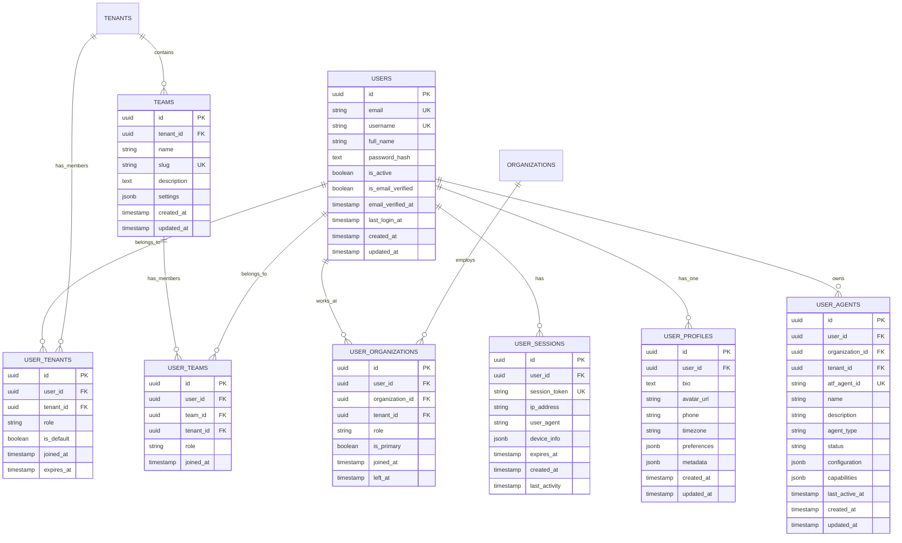

# Complete Data Model Documentation

## Table of Contents
1. [Overview](#overview)
2. [Entity Relationship Diagrams](#entity-relationship-diagrams)
3. [Core Business Domain](#core-business-domain)
4. [Multi-Tenancy & User Management](#multi-tenancy--user-management)
5. [RBAC & Authorization](#rbac--authorization)
6. [OAuth 2.0 & Authentication](#oauth-20--authentication)
7. [MCP & Agent Management](#mcp--agent-management)
8. [Audit & Compliance](#audit--compliance)
9. [Complete SQL Schema](#complete-sql-schema)

## Overview

This document provides the complete data model for the GoldenGate platform - a multi-tenant, agent-native SaaS application with comprehensive RBAC, OAuth 2.0, and MCP server integration.

## Entity Relationship Diagrams

### 1. Core Business Domain ERD


### 2. User & Multi-Tenancy ERD



### 3. RBAC Authorization ERD


### 4. OAuth 2.0 Authentication ERD


### 5. MCP & Agent Management ERD


### 6. Billing & Usage ERD


## Complete SQL Schema

```sql
-- Enable UUID extension
CREATE EXTENSION IF NOT EXISTS "uuid-ossp";

-- =====================================================
-- MULTI-TENANCY & CORE BUSINESS DOMAIN
-- =====================================================

-- Tenants table (root of multi-tenancy)
CREATE TABLE tenants (
    id UUID PRIMARY KEY DEFAULT uuid_generate_v4(),
    slug VARCHAR(100) NOT NULL UNIQUE,
    name VARCHAR(255) NOT NULL,
    domain VARCHAR(255),
    plan VARCHAR(50) DEFAULT 'trial' CHECK (plan IN ('trial', 'starter', 'professional', 'enterprise')),
    status VARCHAR(50) DEFAULT 'active' CHECK (status IN ('active', 'suspended', 'cancelled')),
    settings JSONB DEFAULT '{}',
    max_users INTEGER DEFAULT 5,
    max_organizations INTEGER DEFAULT 100,
    trial_ends_at TIMESTAMP,
    created_at TIMESTAMP DEFAULT NOW(),
    updated_at TIMESTAMP DEFAULT NOW()
);

CREATE INDEX idx_tenants_slug ON tenants(slug);
CREATE INDEX idx_tenants_status ON tenants(status);
CREATE INDEX idx_tenants_plan ON tenants(plan);

-- Organizations table
CREATE TABLE organizations (
    id UUID PRIMARY KEY DEFAULT uuid_generate_v4(),
    tenant_id UUID NOT NULL REFERENCES tenants(id) ON DELETE CASCADE,
    name VARCHAR(255) NOT NULL,
    sector VARCHAR(100),
    location VARCHAR(255),
    state VARCHAR(50),
    description TEXT,
    logo_url TEXT,
    website VARCHAR(255),
    employee_count INTEGER,
    founded_year INTEGER,
    status VARCHAR(50) DEFAULT 'active' CHECK (status IN ('active', 'inactive', 'pending')),
    lifecycle_stage VARCHAR(50),
    created_at TIMESTAMP DEFAULT NOW(),
    updated_at TIMESTAMP DEFAULT NOW()
);

CREATE INDEX idx_organizations_tenant ON organizations(tenant_id);
CREATE INDEX idx_organizations_name ON organizations(name);
CREATE INDEX idx_organizations_sector ON organizations(sector);
CREATE INDEX idx_organizations_status ON organizations(status);

-- Contracts table
CREATE TABLE contracts (
    id UUID PRIMARY KEY DEFAULT uuid_generate_v4(),
    tenant_id UUID NOT NULL REFERENCES tenants(id) ON DELETE CASCADE,
    organization_id UUID REFERENCES organizations(id) ON DELETE CASCADE,
    title VARCHAR(255) NOT NULL,
    value DECIMAL(15, 2),
    start_date DATE,
    end_date DATE,
    status VARCHAR(50) CHECK (status IN ('active', 'completed', 'pending', 'cancelled')),
    type VARCHAR(100),
    description TEXT,
    created_at TIMESTAMP DEFAULT NOW(),
    updated_at TIMESTAMP DEFAULT NOW()
);

CREATE INDEX idx_contracts_tenant_org ON contracts(tenant_id, organization_id);
CREATE INDEX idx_contracts_status ON contracts(status);
CREATE INDEX idx_contracts_dates ON contracts(start_date, end_date);

-- Contract items table
CREATE TABLE contract_items (
    id UUID PRIMARY KEY DEFAULT uuid_generate_v4(),
    contract_id UUID NOT NULL REFERENCES contracts(id) ON DELETE CASCADE,
    item_name VARCHAR(255) NOT NULL,
    amount DECIMAL(15, 2),
    quantity INTEGER DEFAULT 1,
    unit VARCHAR(50),
    created_at TIMESTAMP DEFAULT NOW()
);

CREATE INDEX idx_contract_items_contract ON contract_items(contract_id);

-- Metrics table
CREATE TABLE metrics (
    id UUID PRIMARY KEY DEFAULT uuid_generate_v4(),
    tenant_id UUID NOT NULL REFERENCES tenants(id) ON DELETE CASCADE,
    organization_id UUID REFERENCES organizations(id) ON DELETE CASCADE,
    metric_type VARCHAR(50) NOT NULL,
    value DECIMAL(15, 2),
    unit VARCHAR(20),
    period VARCHAR(20),
    date DATE,
    metadata JSONB DEFAULT '{}',
    created_at TIMESTAMP DEFAULT NOW()
);

CREATE INDEX idx_metrics_tenant_org ON metrics(tenant_id, organization_id);
CREATE INDEX idx_metrics_type_date ON metrics(metric_type, date);

-- Deployments table
CREATE TABLE deployments (
    id UUID PRIMARY KEY DEFAULT uuid_generate_v4(),
    tenant_id UUID NOT NULL REFERENCES tenants(id) ON DELETE CASCADE,
    organization_id UUID REFERENCES organizations(id) ON DELETE CASCADE,
    deployment_type VARCHAR(100),
    status VARCHAR(50) CHECK (status IN ('planned', 'in_progress', 'deployed', 'failed')),
    target_date DATE,
    completed_date DATE,
    notes TEXT,
    configuration JSONB DEFAULT '{}',
    created_by UUID,
    created_at TIMESTAMP DEFAULT NOW(),
    updated_at TIMESTAMP DEFAULT NOW()
);

CREATE INDEX idx_deployments_tenant_org ON deployments(tenant_id, organization_id);
CREATE INDEX idx_deployments_status ON deployments(status);
CREATE INDEX idx_deployments_dates ON deployments(target_date, completed_date);

-- Deployment logs table
CREATE TABLE deployment_logs (
    id UUID PRIMARY KEY DEFAULT uuid_generate_v4(),
    deployment_id UUID NOT NULL REFERENCES deployments(id) ON DELETE CASCADE,
    log_level VARCHAR(20) CHECK (log_level IN ('debug', 'info', 'warning', 'error', 'critical')),
    message TEXT,
    context JSONB DEFAULT '{}',
    created_at TIMESTAMP DEFAULT NOW()
);

CREATE INDEX idx_deployment_logs_deployment ON deployment_logs(deployment_id);
CREATE INDEX idx_deployment_logs_level ON deployment_logs(log_level);

-- =====================================================
-- USER MANAGEMENT
-- =====================================================

-- Users table
CREATE TABLE users (
    id UUID PRIMARY KEY DEFAULT uuid_generate_v4(),
    email VARCHAR(255) NOT NULL UNIQUE,
    username VARCHAR(50) NOT NULL UNIQUE,
    full_name VARCHAR(255),
    password_hash TEXT NOT NULL,
    is_active BOOLEAN DEFAULT true,
    is_email_verified BOOLEAN DEFAULT false,
    email_verified_at TIMESTAMP,
    last_login_at TIMESTAMP,
    created_at TIMESTAMP DEFAULT NOW(),
    updated_at TIMESTAMP DEFAULT NOW()
);

CREATE INDEX idx_users_email ON users(email);
CREATE INDEX idx_users_username ON users(username);
CREATE INDEX idx_users_active ON users(is_active);

-- User profiles table
CREATE TABLE user_profiles (
    id UUID PRIMARY KEY DEFAULT uuid_generate_v4(),
    user_id UUID NOT NULL UNIQUE REFERENCES users(id) ON DELETE CASCADE,
    bio TEXT,
    avatar_url TEXT,
    phone VARCHAR(50),
    timezone VARCHAR(50),
    preferences JSONB DEFAULT '{}',
    metadata JSONB DEFAULT '{}',
    created_at TIMESTAMP DEFAULT NOW(),
    updated_at TIMESTAMP DEFAULT NOW()
);

-- User-tenant relationship
CREATE TABLE user_tenants (
    id UUID PRIMARY KEY DEFAULT uuid_generate_v4(),
    user_id UUID NOT NULL REFERENCES users(id) ON DELETE CASCADE,
    tenant_id UUID NOT NULL REFERENCES tenants(id) ON DELETE CASCADE,
    role VARCHAR(50) DEFAULT 'member' CHECK (role IN ('owner', 'admin', 'member', 'viewer')),
    is_default BOOLEAN DEFAULT false,
    joined_at TIMESTAMP DEFAULT NOW(),
    expires_at TIMESTAMP,
    UNIQUE(user_id, tenant_id)
);

CREATE INDEX idx_user_tenants_user ON user_tenants(user_id);
CREATE INDEX idx_user_tenants_tenant ON user_tenants(tenant_id);

-- User-organization relationship (users must belong to organizations)
CREATE TABLE user_organizations (
    id UUID PRIMARY KEY DEFAULT uuid_generate_v4(),
    user_id UUID NOT NULL REFERENCES users(id) ON DELETE CASCADE,
    organization_id UUID NOT NULL REFERENCES organizations(id) ON DELETE CASCADE,
    tenant_id UUID NOT NULL REFERENCES tenants(id) ON DELETE CASCADE,
    role VARCHAR(50) DEFAULT 'member' CHECK (role IN ('owner', 'admin', 'manager', 'member', 'contractor')),
    is_primary BOOLEAN DEFAULT false,
    joined_at TIMESTAMP DEFAULT NOW(),
    left_at TIMESTAMP,
    UNIQUE(user_id, organization_id)
);

CREATE INDEX idx_user_orgs_user ON user_organizations(user_id);
CREATE INDEX idx_user_orgs_org ON user_organizations(organization_id);
CREATE INDEX idx_user_orgs_tenant ON user_organizations(tenant_id);
CREATE INDEX idx_user_orgs_primary ON user_organizations(user_id, is_primary) WHERE is_primary = true;

-- Teams table
CREATE TABLE teams (
    id UUID PRIMARY KEY DEFAULT uuid_generate_v4(),
    tenant_id UUID NOT NULL REFERENCES tenants(id) ON DELETE CASCADE,
    name VARCHAR(255) NOT NULL,
    slug VARCHAR(255) NOT NULL,
    description TEXT,
    settings JSONB DEFAULT '{}',
    created_at TIMESTAMP DEFAULT NOW(),
    updated_at TIMESTAMP DEFAULT NOW(),
    UNIQUE(tenant_id, slug)
);

CREATE INDEX idx_teams_tenant ON teams(tenant_id);
CREATE INDEX idx_teams_slug ON teams(slug);

-- User-team relationship
CREATE TABLE user_teams (
    id UUID PRIMARY KEY DEFAULT uuid_generate_v4(),
    user_id UUID NOT NULL REFERENCES users(id) ON DELETE CASCADE,
    team_id UUID NOT NULL REFERENCES teams(id) ON DELETE CASCADE,
    tenant_id UUID NOT NULL REFERENCES tenants(id) ON DELETE CASCADE,
    role VARCHAR(50) DEFAULT 'member' CHECK (role IN ('owner', 'admin', 'member')),
    joined_at TIMESTAMP DEFAULT NOW(),
    UNIQUE(user_id, team_id)
);

CREATE INDEX idx_user_teams_user_tenant ON user_teams(user_id, tenant_id);
CREATE INDEX idx_user_teams_team ON user_teams(team_id);

-- User sessions table
CREATE TABLE user_sessions (
    id UUID PRIMARY KEY DEFAULT uuid_generate_v4(),
    user_id UUID NOT NULL REFERENCES users(id) ON DELETE CASCADE,
    session_token VARCHAR(255) NOT NULL UNIQUE,
    ip_address VARCHAR(45),
    user_agent TEXT,
    device_info JSONB DEFAULT '{}',
    expires_at TIMESTAMP NOT NULL,
    created_at TIMESTAMP DEFAULT NOW(),
    last_activity TIMESTAMP DEFAULT NOW()
);

CREATE INDEX idx_user_sessions_user ON user_sessions(user_id);
CREATE INDEX idx_user_sessions_token ON user_sessions(session_token);
CREATE INDEX idx_user_sessions_expires ON user_sessions(expires_at);

-- User agents table (for Agent Taskflow integration)
CREATE TABLE user_agents (
    id UUID PRIMARY KEY DEFAULT uuid_generate_v4(),
    user_id UUID NOT NULL REFERENCES users(id) ON DELETE CASCADE,
    organization_id UUID NOT NULL REFERENCES organizations(id) ON DELETE CASCADE,
    tenant_id UUID NOT NULL REFERENCES tenants(id) ON DELETE CASCADE,
    atf_agent_id VARCHAR(255) NOT NULL UNIQUE, -- Agent Taskflow agent ID
    name VARCHAR(255) NOT NULL,
    description TEXT,
    agent_type VARCHAR(100), -- e.g., 'analyst', 'reporter', 'monitor', 'workflow'
    status VARCHAR(50) DEFAULT 'active' CHECK (status IN ('active', 'inactive', 'paused', 'error')),
    configuration JSONB DEFAULT '{}', -- Agent-specific configuration
    capabilities JSONB DEFAULT '{}', -- What the agent can do
    last_active_at TIMESTAMP,
    created_at TIMESTAMP DEFAULT NOW(),
    updated_at TIMESTAMP DEFAULT NOW()
);

CREATE INDEX idx_user_agents_user ON user_agents(user_id);
CREATE INDEX idx_user_agents_org ON user_agents(organization_id);
CREATE INDEX idx_user_agents_tenant ON user_agents(tenant_id);
CREATE INDEX idx_user_agents_atf_id ON user_agents(atf_agent_id);
CREATE INDEX idx_user_agents_status ON user_agents(status);
CREATE INDEX idx_user_agents_type ON user_agents(agent_type);

-- =====================================================
-- RBAC (ROLE-BASED ACCESS CONTROL)
-- =====================================================

-- Policies table
CREATE TABLE policies (
    id UUID PRIMARY KEY DEFAULT uuid_generate_v4(),
    name VARCHAR(100) NOT NULL UNIQUE,
    description TEXT,
    resource VARCHAR(100) NOT NULL,
    action VARCHAR(50) NOT NULL,
    conditions JSONB DEFAULT '{}',
    effect VARCHAR(10) DEFAULT 'allow' CHECK (effect IN ('allow', 'deny')),
    priority INTEGER DEFAULT 0,
    created_at TIMESTAMP DEFAULT NOW(),
    updated_at TIMESTAMP DEFAULT NOW()
);

CREATE INDEX idx_policies_resource_action ON policies(resource, action);
CREATE INDEX idx_policies_effect ON policies(effect);

-- Roles table
CREATE TABLE roles (
    id UUID PRIMARY KEY DEFAULT uuid_generate_v4(),
    tenant_id UUID REFERENCES tenants(id) ON DELETE CASCADE,
    name VARCHAR(100) NOT NULL,
    description TEXT,
    is_system BOOLEAN DEFAULT false,
    is_default BOOLEAN DEFAULT false,
    max_users INTEGER,
    metadata JSONB DEFAULT '{}',
    created_at TIMESTAMP DEFAULT NOW(),
    updated_at TIMESTAMP DEFAULT NOW(),
    UNIQUE(tenant_id, name)
);

CREATE INDEX idx_roles_tenant_name ON roles(tenant_id, name);
CREATE INDEX idx_roles_is_default ON roles(is_default);

-- Role-policy mapping
CREATE TABLE role_policies (
    id UUID PRIMARY KEY DEFAULT uuid_generate_v4(),
    role_id UUID NOT NULL REFERENCES roles(id) ON DELETE CASCADE,
    policy_id UUID NOT NULL REFERENCES policies(id) ON DELETE CASCADE,
    tenant_id UUID REFERENCES tenants(id) ON DELETE CASCADE,
    custom_conditions JSONB DEFAULT '{}',
    expires_at TIMESTAMP,
    created_at TIMESTAMP DEFAULT NOW(),
    UNIQUE(role_id, policy_id)
);

CREATE INDEX idx_role_policies_role ON role_policies(role_id);
CREATE INDEX idx_role_policies_policy ON role_policies(policy_id);

-- User-role mapping
CREATE TABLE user_roles (
    id UUID PRIMARY KEY DEFAULT uuid_generate_v4(),
    user_id UUID NOT NULL REFERENCES users(id) ON DELETE CASCADE,
    role_id UUID NOT NULL REFERENCES roles(id) ON DELETE CASCADE,
    tenant_id UUID NOT NULL REFERENCES tenants(id) ON DELETE CASCADE,
    granted_by UUID REFERENCES users(id),
    expires_at TIMESTAMP,
    created_at TIMESTAMP DEFAULT NOW(),
    UNIQUE(user_id, role_id, tenant_id)
);

CREATE INDEX idx_user_roles_user_tenant ON user_roles(user_id, tenant_id);
CREATE INDEX idx_user_roles_role ON user_roles(role_id);

-- =====================================================
-- OAUTH 2.0 AUTHENTICATION
-- =====================================================

-- OAuth clients table
CREATE TABLE oauth_clients (
    id UUID PRIMARY KEY DEFAULT uuid_generate_v4(),
    client_id VARCHAR(255) NOT NULL UNIQUE,
    client_secret TEXT NOT NULL,
    tenant_id UUID REFERENCES tenants(id) ON DELETE CASCADE,
    name VARCHAR(255) NOT NULL,
    redirect_uris JSONB NOT NULL,
    grant_types JSONB NOT NULL,
    response_types JSONB NOT NULL,
    scopes JSONB NOT NULL,
    client_type VARCHAR(20) NOT NULL CHECK (client_type IN ('confidential', 'public')),
    token_endpoint_auth_method VARCHAR(50) DEFAULT 'client_secret_basic',
    jwks_uri TEXT,
    logo_uri TEXT,
    policy_uri TEXT,
    tos_uri TEXT,
    metadata JSONB DEFAULT '{}',
    created_at TIMESTAMP DEFAULT NOW(),
    updated_at TIMESTAMP DEFAULT NOW()
);

CREATE INDEX idx_oauth_clients_client_id ON oauth_clients(client_id);
CREATE INDEX idx_oauth_clients_tenant ON oauth_clients(tenant_id);

-- OAuth authorization codes table
CREATE TABLE oauth_authorization_codes (
    id UUID PRIMARY KEY DEFAULT uuid_generate_v4(),
    code VARCHAR(255) NOT NULL UNIQUE,
    client_id UUID REFERENCES oauth_clients(id) ON DELETE CASCADE,
    user_id UUID REFERENCES users(id) ON DELETE CASCADE,
    redirect_uri TEXT NOT NULL,
    scopes JSONB NOT NULL,
    code_challenge VARCHAR(255),
    code_challenge_method VARCHAR(10) CHECK (code_challenge_method IN ('S256', 'plain')),
    nonce VARCHAR(255),
    expires_at TIMESTAMP NOT NULL,
    used_at TIMESTAMP,
    created_at TIMESTAMP DEFAULT NOW()
);

CREATE INDEX idx_oauth_codes_code ON oauth_authorization_codes(code);
CREATE INDEX idx_oauth_codes_expires ON oauth_authorization_codes(expires_at);

-- OAuth access tokens table
CREATE TABLE oauth_access_tokens (
    id UUID PRIMARY KEY DEFAULT uuid_generate_v4(),
    token TEXT NOT NULL UNIQUE,
    token_type VARCHAR(20) DEFAULT 'Bearer' CHECK (token_type IN ('Bearer', 'DPoP')),
    client_id UUID REFERENCES oauth_clients(id) ON DELETE CASCADE,
    user_id UUID REFERENCES users(id) ON DELETE CASCADE,
    agent_id UUID,
    scopes JSONB NOT NULL,
    audience JSONB,
    expires_at TIMESTAMP NOT NULL,
    revoked_at TIMESTAMP,
    metadata JSONB DEFAULT '{}',
    created_at TIMESTAMP DEFAULT NOW()
);

CREATE INDEX idx_oauth_tokens_token ON oauth_access_tokens(token);
CREATE INDEX idx_oauth_tokens_user ON oauth_access_tokens(user_id);
CREATE INDEX idx_oauth_tokens_expires ON oauth_access_tokens(expires_at);

-- OAuth refresh tokens table
CREATE TABLE oauth_refresh_tokens (
    id UUID PRIMARY KEY DEFAULT uuid_generate_v4(),
    token TEXT NOT NULL UNIQUE,
    access_token_id UUID REFERENCES oauth_access_tokens(id) ON DELETE CASCADE,
    client_id UUID REFERENCES oauth_clients(id) ON DELETE CASCADE,
    user_id UUID REFERENCES users(id) ON DELETE CASCADE,
    scopes JSONB NOT NULL,
    expires_at TIMESTAMP,
    revoked_at TIMESTAMP,
    rotated_from UUID REFERENCES oauth_refresh_tokens(id),
    created_at TIMESTAMP DEFAULT NOW()
);

CREATE INDEX idx_oauth_refresh_token ON oauth_refresh_tokens(token);
CREATE INDEX idx_oauth_refresh_access ON oauth_refresh_tokens(access_token_id);

-- OAuth device codes table
CREATE TABLE oauth_device_codes (
    id UUID PRIMARY KEY DEFAULT uuid_generate_v4(),
    device_code VARCHAR(255) NOT NULL UNIQUE,
    user_code VARCHAR(20) NOT NULL UNIQUE,
    client_id UUID REFERENCES oauth_clients(id) ON DELETE CASCADE,
    scopes JSONB NOT NULL,
    interval INTEGER DEFAULT 5,
    expires_at TIMESTAMP NOT NULL,
    authorized_at TIMESTAMP,
    user_id UUID REFERENCES users(id) ON DELETE CASCADE,
    created_at TIMESTAMP DEFAULT NOW()
);

CREATE INDEX idx_oauth_device_code ON oauth_device_codes(device_code);
CREATE INDEX idx_oauth_user_code ON oauth_device_codes(user_code);

-- =====================================================
-- MCP & AGENT MANAGEMENT
-- =====================================================

-- Agents table
CREATE TABLE agents (
    id UUID PRIMARY KEY DEFAULT uuid_generate_v4(),
    tenant_id UUID NOT NULL REFERENCES tenants(id) ON DELETE CASCADE,
    name VARCHAR(255) NOT NULL,
    type VARCHAR(50) NOT NULL,
    status VARCHAR(50) DEFAULT 'active' CHECK (status IN ('active', 'inactive', 'suspended')),
    capabilities JSONB DEFAULT '{}',
    configuration JSONB DEFAULT '{}',
    api_key_hash TEXT,
    rate_limit INTEGER DEFAULT 60,
    last_active_at TIMESTAMP,
    created_at TIMESTAMP DEFAULT NOW(),
    updated_at TIMESTAMP DEFAULT NOW()
);

CREATE INDEX idx_agents_tenant ON agents(tenant_id);
CREATE INDEX idx_agents_status ON agents(status);

-- Agent permissions table
CREATE TABLE agent_permissions (
    id UUID PRIMARY KEY DEFAULT uuid_generate_v4(),
    agent_id UUID NOT NULL,
    tenant_id UUID REFERENCES tenants(id) ON DELETE CASCADE,
    scope VARCHAR(50) CHECK (scope IN ('read', 'write', 'admin', 'execute')),
    resources JSONB DEFAULT '{}',
    tools JSONB DEFAULT '{}',
    rate_limit INTEGER,
    expires_at TIMESTAMP,
    created_at TIMESTAMP DEFAULT NOW()
);

CREATE INDEX idx_agent_permissions_agent ON agent_permissions(agent_id);
CREATE INDEX idx_agent_permissions_tenant ON agent_permissions(tenant_id);

-- Agent roles table
CREATE TABLE agent_roles (
    id UUID PRIMARY KEY DEFAULT uuid_generate_v4(),
    agent_id UUID NOT NULL,
    role_id UUID NOT NULL REFERENCES roles(id) ON DELETE CASCADE,
    tenant_id UUID NOT NULL REFERENCES tenants(id) ON DELETE CASCADE,
    granted_by UUID REFERENCES users(id),
    expires_at TIMESTAMP,
    created_at TIMESTAMP DEFAULT NOW(),
    UNIQUE(agent_id, role_id, tenant_id)
);

CREATE INDEX idx_agent_roles_agent_tenant ON agent_roles(agent_id, tenant_id);

-- Agent sessions table
CREATE TABLE agent_sessions (
    id UUID PRIMARY KEY DEFAULT uuid_generate_v4(),
    agent_id UUID NOT NULL,
    session_token VARCHAR(255) NOT NULL UNIQUE,
    transport_type VARCHAR(50),
    connection_info JSONB DEFAULT '{}',
    connected_at TIMESTAMP DEFAULT NOW(),
    disconnected_at TIMESTAMP,
    last_heartbeat TIMESTAMP DEFAULT NOW()
);

CREATE INDEX idx_agent_sessions_agent ON agent_sessions(agent_id);
CREATE INDEX idx_agent_sessions_token ON agent_sessions(session_token);

-- Agent workflows table
CREATE TABLE agent_workflows (
    id UUID PRIMARY KEY DEFAULT uuid_generate_v4(),
    tenant_id UUID NOT NULL REFERENCES tenants(id) ON DELETE CASCADE,
    name VARCHAR(255) NOT NULL,
    description TEXT,
    steps JSONB NOT NULL,
    triggers JSONB DEFAULT '{}',
    conditions JSONB DEFAULT '{}',
    is_active BOOLEAN DEFAULT true,
    created_at TIMESTAMP DEFAULT NOW(),
    updated_at TIMESTAMP DEFAULT NOW()
);

CREATE INDEX idx_agent_workflows_tenant ON agent_workflows(tenant_id);
CREATE INDEX idx_agent_workflows_active ON agent_workflows(is_active);

-- Workflow executions table
CREATE TABLE workflow_executions (
    id UUID PRIMARY KEY DEFAULT uuid_generate_v4(),
    workflow_id UUID NOT NULL REFERENCES agent_workflows(id) ON DELETE CASCADE,
    agent_id UUID NOT NULL,
    status VARCHAR(50) CHECK (status IN ('pending', 'running', 'completed', 'failed', 'cancelled')),
    input_params JSONB DEFAULT '{}',
    output_results JSONB DEFAULT '{}',
    execution_context JSONB DEFAULT '{}',
    started_at TIMESTAMP DEFAULT NOW(),
    completed_at TIMESTAMP,
    duration_ms INTEGER
);

CREATE INDEX idx_workflow_executions_workflow ON workflow_executions(workflow_id);
CREATE INDEX idx_workflow_executions_agent ON workflow_executions(agent_id);
CREATE INDEX idx_workflow_executions_status ON workflow_executions(status);

-- Workflow logs table
CREATE TABLE workflow_logs (
    id UUID PRIMARY KEY DEFAULT uuid_generate_v4(),
    execution_id UUID NOT NULL REFERENCES workflow_executions(id) ON DELETE CASCADE,
    step_name VARCHAR(255),
    log_level VARCHAR(20) CHECK (log_level IN ('debug', 'info', 'warning', 'error', 'critical')),
    message TEXT,
    data JSONB DEFAULT '{}',
    created_at TIMESTAMP DEFAULT NOW()
);

CREATE INDEX idx_workflow_logs_execution ON workflow_logs(execution_id);

-- Agent executions table (for user agents via ATF)
CREATE TABLE agent_executions (
    id UUID PRIMARY KEY DEFAULT uuid_generate_v4(),
    user_agent_id UUID NOT NULL REFERENCES user_agents(id) ON DELETE CASCADE,
    atf_execution_id VARCHAR(255) NOT NULL UNIQUE, -- Agent Taskflow execution ID
    task_name VARCHAR(255),
    status VARCHAR(50) CHECK (status IN ('pending', 'running', 'completed', 'failed', 'cancelled')),
    input_params JSONB DEFAULT '{}',
    output_results JSONB DEFAULT '{}',
    execution_context JSONB DEFAULT '{}',
    started_at TIMESTAMP DEFAULT NOW(),
    completed_at TIMESTAMP,
    duration_ms INTEGER
);

CREATE INDEX idx_agent_executions_user_agent ON agent_executions(user_agent_id);
CREATE INDEX idx_agent_executions_atf_id ON agent_executions(atf_execution_id);
CREATE INDEX idx_agent_executions_status ON agent_executions(status);
CREATE INDEX idx_agent_executions_started ON agent_executions(started_at);

-- Agent audit log table
CREATE TABLE agent_audit_log (
    id UUID PRIMARY KEY DEFAULT uuid_generate_v4(),
    agent_id UUID, -- For system agents
    user_agent_id UUID REFERENCES user_agents(id) ON DELETE CASCADE, -- For user agents
    tenant_id UUID REFERENCES tenants(id) ON DELETE CASCADE,
    action VARCHAR(100),
    resource VARCHAR(255),
    parameters JSONB DEFAULT '{}',
    result JSONB DEFAULT '{}',
    duration_ms INTEGER,
    ip_address VARCHAR(45),
    created_at TIMESTAMP DEFAULT NOW()
);

CREATE INDEX idx_agent_audit_agent ON agent_audit_log(agent_id);
CREATE INDEX idx_agent_audit_user_agent ON agent_audit_log(user_agent_id);
CREATE INDEX idx_agent_audit_tenant ON agent_audit_log(tenant_id);
CREATE INDEX idx_agent_audit_action ON agent_audit_log(action);
CREATE INDEX idx_agent_audit_created ON agent_audit_log(created_at);

-- =====================================================
-- BILLING & USAGE
-- =====================================================

-- Billing plans table
CREATE TABLE billing_plans (
    id UUID PRIMARY KEY DEFAULT uuid_generate_v4(),
    name VARCHAR(100) NOT NULL,
    slug VARCHAR(100) NOT NULL UNIQUE,
    max_users INTEGER,
    max_organizations INTEGER,
    max_api_calls INTEGER,
    max_storage_gb INTEGER,
    price_monthly DECIMAL(10, 2),
    price_yearly DECIMAL(10, 2),
    features JSONB DEFAULT '{}',
    is_active BOOLEAN DEFAULT true,
    created_at TIMESTAMP DEFAULT NOW(),
    updated_at TIMESTAMP DEFAULT NOW()
);

CREATE INDEX idx_billing_plans_slug ON billing_plans(slug);
CREATE INDEX idx_billing_plans_active ON billing_plans(is_active);

-- Subscriptions table
CREATE TABLE subscriptions (
    id UUID PRIMARY KEY DEFAULT uuid_generate_v4(),
    tenant_id UUID NOT NULL REFERENCES tenants(id) ON DELETE CASCADE,
    plan_id UUID NOT NULL REFERENCES billing_plans(id),
    status VARCHAR(50) CHECK (status IN ('active', 'cancelled', 'past_due', 'trialing', 'paused')),
    current_period_start DATE,
    current_period_end DATE,
    trial_start DATE,
    trial_end DATE,
    cancel_at_period_end BOOLEAN DEFAULT false,
    metadata JSONB DEFAULT '{}',
    created_at TIMESTAMP DEFAULT NOW(),
    updated_at TIMESTAMP DEFAULT NOW()
);

CREATE INDEX idx_subscriptions_tenant ON subscriptions(tenant_id);
CREATE INDEX idx_subscriptions_status ON subscriptions(status);

-- Invoices table
CREATE TABLE invoices (
    id UUID PRIMARY KEY DEFAULT uuid_generate_v4(),
    subscription_id UUID REFERENCES subscriptions(id),
    tenant_id UUID NOT NULL REFERENCES tenants(id) ON DELETE CASCADE,
    invoice_number VARCHAR(50) NOT NULL UNIQUE,
    subtotal DECIMAL(10, 2),
    tax DECIMAL(10, 2),
    total DECIMAL(10, 2),
    status VARCHAR(50) CHECK (status IN ('draft', 'open', 'paid', 'void', 'uncollectible')),
    due_date DATE,
    paid_at TIMESTAMP,
    metadata JSONB DEFAULT '{}',
    created_at TIMESTAMP DEFAULT NOW()
);

CREATE INDEX idx_invoices_tenant ON invoices(tenant_id);
CREATE INDEX idx_invoices_subscription ON invoices(subscription_id);
CREATE INDEX idx_invoices_status ON invoices(status);
CREATE INDEX idx_invoices_number ON invoices(invoice_number);

-- Invoice items table
CREATE TABLE invoice_items (
    id UUID PRIMARY KEY DEFAULT uuid_generate_v4(),
    invoice_id UUID NOT NULL REFERENCES invoices(id) ON DELETE CASCADE,
    description TEXT,
    quantity INTEGER DEFAULT 1,
    unit_price DECIMAL(10, 2),
    amount DECIMAL(10, 2),
    metadata JSONB DEFAULT '{}',
    created_at TIMESTAMP DEFAULT NOW()
);

CREATE INDEX idx_invoice_items_invoice ON invoice_items(invoice_id);

-- Payments table
CREATE TABLE payments (
    id UUID PRIMARY KEY DEFAULT uuid_generate_v4(),
    invoice_id UUID REFERENCES invoices(id),
    tenant_id UUID NOT NULL REFERENCES tenants(id) ON DELETE CASCADE,
    amount DECIMAL(10, 2) NOT NULL,
    currency VARCHAR(3) DEFAULT 'USD',
    payment_method VARCHAR(50),
    transaction_id VARCHAR(255),
    status VARCHAR(50) CHECK (status IN ('pending', 'processing', 'succeeded', 'failed', 'cancelled')),
    payment_details JSONB DEFAULT '{}',
    created_at TIMESTAMP DEFAULT NOW()
);

CREATE INDEX idx_payments_invoice ON payments(invoice_id);
CREATE INDEX idx_payments_tenant ON payments(tenant_id);
CREATE INDEX idx_payments_status ON payments(status);

-- Usage metrics table
CREATE TABLE usage_metrics (
    id UUID PRIMARY KEY DEFAULT uuid_generate_v4(),
    tenant_id UUID NOT NULL REFERENCES tenants(id) ON DELETE CASCADE,
    metric_type VARCHAR(50) NOT NULL,
    value INTEGER NOT NULL,
    period DATE NOT NULL,
    breakdown JSONB DEFAULT '{}',
    created_at TIMESTAMP DEFAULT NOW()
);

CREATE INDEX idx_usage_metrics_tenant_period ON usage_metrics(tenant_id, period);
CREATE INDEX idx_usage_metrics_type ON usage_metrics(metric_type);

-- Billing contacts table
CREATE TABLE billing_contacts (
    id UUID PRIMARY KEY DEFAULT uuid_generate_v4(),
    tenant_id UUID NOT NULL REFERENCES tenants(id) ON DELETE CASCADE,
    name VARCHAR(255) NOT NULL,
    email VARCHAR(255) NOT NULL,
    phone VARCHAR(50),
    address TEXT,
    is_primary BOOLEAN DEFAULT false,
    created_at TIMESTAMP DEFAULT NOW(),
    updated_at TIMESTAMP DEFAULT NOW()
);

CREATE INDEX idx_billing_contacts_tenant ON billing_contacts(tenant_id);

-- =====================================================
-- AUDIT & COMPLIANCE
-- =====================================================

-- System audit log table
CREATE TABLE system_audit_log (
    id UUID PRIMARY KEY DEFAULT uuid_generate_v4(),
    tenant_id UUID REFERENCES tenants(id) ON DELETE CASCADE,
    user_id UUID REFERENCES users(id),
    action VARCHAR(100) NOT NULL,
    resource_type VARCHAR(100),
    resource_id UUID,
    old_values JSONB,
    new_values JSONB,
    ip_address VARCHAR(45),
    user_agent TEXT,
    created_at TIMESTAMP DEFAULT NOW()
);

CREATE INDEX idx_system_audit_tenant ON system_audit_log(tenant_id);
CREATE INDEX idx_system_audit_user ON system_audit_log(user_id);
CREATE INDEX idx_system_audit_action ON system_audit_log(action);
CREATE INDEX idx_system_audit_created ON system_audit_log(created_at);

-- =====================================================
-- ROW LEVEL SECURITY (RLS)
-- =====================================================

-- Enable RLS on tenant-scoped tables
ALTER TABLE organizations ENABLE ROW LEVEL SECURITY;
ALTER TABLE contracts ENABLE ROW LEVEL SECURITY;
ALTER TABLE metrics ENABLE ROW LEVEL SECURITY;
ALTER TABLE deployments ENABLE ROW LEVEL SECURITY;
ALTER TABLE user_organizations ENABLE ROW LEVEL SECURITY;
ALTER TABLE user_agents ENABLE ROW LEVEL SECURITY;
ALTER TABLE agent_executions ENABLE ROW LEVEL SECURITY;

-- Create RLS policies
CREATE POLICY tenant_isolation_organizations ON organizations
    FOR ALL
    USING (tenant_id = current_setting('app.current_tenant_id')::uuid);

CREATE POLICY tenant_isolation_contracts ON contracts
    FOR ALL
    USING (tenant_id = current_setting('app.current_tenant_id')::uuid);

CREATE POLICY tenant_isolation_metrics ON metrics
    FOR ALL
    USING (tenant_id = current_setting('app.current_tenant_id')::uuid);

CREATE POLICY tenant_isolation_deployments ON deployments
    FOR ALL
    USING (tenant_id = current_setting('app.current_tenant_id')::uuid);

CREATE POLICY tenant_isolation_user_organizations ON user_organizations
    FOR ALL
    USING (tenant_id = current_setting('app.current_tenant_id')::uuid);

CREATE POLICY tenant_isolation_user_agents ON user_agents
    FOR ALL
    USING (tenant_id = current_setting('app.current_tenant_id')::uuid);

-- Agent executions inherit tenant isolation through user_agents
CREATE POLICY tenant_isolation_agent_executions ON agent_executions
    FOR ALL
    USING (EXISTS (
        SELECT 1 FROM user_agents ua 
        WHERE ua.id = agent_executions.user_agent_id 
        AND ua.tenant_id = current_setting('app.current_tenant_id')::uuid
    ));

-- =====================================================
-- FUNCTIONS & TRIGGERS
-- =====================================================

-- Update timestamp function
CREATE OR REPLACE FUNCTION update_updated_at_column()
RETURNS TRIGGER AS $$
BEGIN
    NEW.updated_at = NOW();
    RETURN NEW;
END;
$$ LANGUAGE plpgsql;

-- Create update triggers
CREATE TRIGGER update_tenants_updated_at BEFORE UPDATE ON tenants
    FOR EACH ROW EXECUTE FUNCTION update_updated_at_column();

CREATE TRIGGER update_organizations_updated_at BEFORE UPDATE ON organizations
    FOR EACH ROW EXECUTE FUNCTION update_updated_at_column();

CREATE TRIGGER update_users_updated_at BEFORE UPDATE ON users
    FOR EACH ROW EXECUTE FUNCTION update_updated_at_column();

CREATE TRIGGER update_roles_updated_at BEFORE UPDATE ON roles
    FOR EACH ROW EXECUTE FUNCTION update_updated_at_column();

CREATE TRIGGER update_user_agents_updated_at BEFORE UPDATE ON user_agents
    FOR EACH ROW EXECUTE FUNCTION update_updated_at_column();

-- Function to check user permissions
CREATE OR REPLACE FUNCTION check_user_permission(
    p_user_id UUID,
    p_tenant_id UUID,
    p_resource VARCHAR,
    p_action VARCHAR
) RETURNS BOOLEAN AS $$
DECLARE
    v_has_permission BOOLEAN := FALSE;
BEGIN
    SELECT EXISTS (
        SELECT 1
        FROM user_roles ur
        JOIN role_policies rp ON ur.role_id = rp.role_id
        JOIN policies p ON rp.policy_id = p.id
        WHERE ur.user_id = p_user_id
            AND ur.tenant_id = p_tenant_id
            AND (p.resource = p_resource OR p.resource = '*')
            AND (p.action = p_action OR p.action = '*')
            AND p.effect = 'allow'
            AND (ur.expires_at IS NULL OR ur.expires_at > NOW())
            AND (rp.expires_at IS NULL OR rp.expires_at > NOW())
    ) INTO v_has_permission;
    
    RETURN v_has_permission;
END;
$$ LANGUAGE plpgsql;

-- Function to get tenant usage
CREATE OR REPLACE FUNCTION get_tenant_usage(p_tenant_id UUID)
RETURNS TABLE (
    user_count INTEGER,
    organization_count INTEGER,
    contract_count INTEGER,
    total_contract_value DECIMAL,
    active_agents_count INTEGER
) AS $$
BEGIN
    RETURN QUERY
    SELECT 
        (SELECT COUNT(*) FROM user_tenants WHERE tenant_id = p_tenant_id)::INTEGER as user_count,
        (SELECT COUNT(*) FROM organizations WHERE tenant_id = p_tenant_id)::INTEGER as organization_count,
        (SELECT COUNT(*) FROM contracts WHERE tenant_id = p_tenant_id)::INTEGER as contract_count,
        COALESCE((SELECT SUM(value) FROM contracts WHERE tenant_id = p_tenant_id), 0) as total_contract_value,
        (SELECT COUNT(*) FROM user_agents WHERE tenant_id = p_tenant_id AND status = 'active')::INTEGER as active_agents_count;
END;
$$ LANGUAGE plpgsql;

-- Function to check if user belongs to organization
CREATE OR REPLACE FUNCTION user_belongs_to_organization(
    p_user_id UUID,
    p_organization_id UUID,
    p_tenant_id UUID
) RETURNS BOOLEAN AS $$
BEGIN
    RETURN EXISTS (
        SELECT 1 FROM user_organizations
        WHERE user_id = p_user_id
        AND organization_id = p_organization_id
        AND tenant_id = p_tenant_id
        AND left_at IS NULL
    );
END;
$$ LANGUAGE plpgsql;

-- Function to get user's primary organization
CREATE OR REPLACE FUNCTION get_user_primary_organization(
    p_user_id UUID,
    p_tenant_id UUID
) RETURNS UUID AS $$
DECLARE
    v_org_id UUID;
BEGIN
    SELECT organization_id INTO v_org_id
    FROM user_organizations
    WHERE user_id = p_user_id
    AND tenant_id = p_tenant_id
    AND is_primary = true
    AND left_at IS NULL;
    
    -- If no primary organization, return the first one
    IF v_org_id IS NULL THEN
        SELECT organization_id INTO v_org_id
        FROM user_organizations
        WHERE user_id = p_user_id
        AND tenant_id = p_tenant_id
        AND left_at IS NULL
        ORDER BY joined_at ASC
        LIMIT 1;
    END IF;
    
    RETURN v_org_id;
END;
$$ LANGUAGE plpgsql;

-- =====================================================
-- INITIAL DATA
-- =====================================================

-- Insert default policies
INSERT INTO policies (name, description, resource, action, effect) VALUES
('org:create', 'Create organizations', 'organizations', 'create', 'allow'),
('org:read', 'Read organizations', 'organizations', 'read', 'allow'),
('org:update', 'Update organizations', 'organizations', 'update', 'allow'),
('org:delete', 'Delete organizations', 'organizations', 'delete', 'allow'),
('org:list', 'List organizations', 'organizations', 'list', 'allow'),
('contract:create', 'Create contracts', 'contracts', 'create', 'allow'),
('contract:read', 'Read contracts', 'contracts', 'read', 'allow'),
('contract:update', 'Update contracts', 'contracts', 'update', 'allow'),
('contract:delete', 'Delete contracts', 'contracts', 'delete', 'allow'),
('mcp:connect', 'Connect via MCP', 'mcp', 'connect', 'allow'),
('mcp:tool:use', 'Use MCP tools', 'mcp.tools', 'execute', 'allow'),
('mcp:resource:read', 'Read MCP resources', 'mcp.resources', 'read', 'allow');

-- Insert default billing plans
INSERT INTO billing_plans (name, slug, max_users, max_organizations, max_api_calls, price_monthly, price_yearly, features) VALUES
('Trial', 'trial', 5, 10, 1000, 0, 0, '{"features": ["basic_dashboard", "email_support"]}'),
('Starter', 'starter', 10, 50, 10000, 99, 990, '{"features": ["full_dashboard", "api_access", "email_support"]}'),
('Professional', 'professional', 50, 500, 100000, 499, 4990, '{"features": ["full_dashboard", "api_access", "priority_support", "custom_reports"]}'),
('Enterprise', 'enterprise', NULL, NULL, NULL, NULL, NULL, '{"features": ["everything", "dedicated_support", "sla", "custom_integration"]}');

-- Create indexes for common queries
CREATE INDEX idx_contracts_value ON contracts(value);
CREATE INDEX idx_metrics_value ON metrics(value);
CREATE INDEX idx_agent_audit_log_date_range ON agent_audit_log(created_at, tenant_id);
CREATE INDEX idx_system_audit_log_date_range ON system_audit_log(created_at, tenant_id);

-- Add comments for documentation
COMMENT ON TABLE tenants IS 'Root table for multi-tenant isolation';
COMMENT ON TABLE organizations IS 'Organizations/companies tracked within each tenant';
COMMENT ON TABLE contracts IS 'Contract and award information for organizations';
COMMENT ON TABLE users IS 'System users - can belong to multiple tenants';
COMMENT ON TABLE user_organizations IS 'User-organization relationships - users must belong to at least one organization';
COMMENT ON TABLE user_agents IS 'User-owned AI agents managed through Agent Taskflow (ATF)';
COMMENT ON TABLE agent_executions IS 'Execution history for user agents via ATF';
COMMENT ON TABLE policies IS 'Fine-grained permission policies for RBAC';
COMMENT ON TABLE roles IS 'Named collections of policies';
COMMENT ON TABLE agents IS 'System-level AI agents with MCP access';
COMMENT ON TABLE oauth_clients IS 'OAuth 2.0 client applications';
COMMENT ON TABLE agent_audit_log IS 'Complete audit trail of all agent actions (system and user agents)';
COMMENT ON TABLE system_audit_log IS 'Complete audit trail of all system changes';
```