# GoldenGate Platform - Documentation Hub

Complete documentation for the GoldenGate federal contractor intelligence platform.

## 📚 Quick Navigation

### New to GoldenGate?
- **[Business Guide](BUSINESS_GUIDE.md)** - Non-technical overview for stakeholders and executives
- **[Integration Guide](INTEGRATION_GUIDE.md)** - How gg-mvp works with gg-infra infrastructure
- **[Visual Guide](VISUAL_GUIDE.md)** - Interactive diagrams and architecture flows

### Technical Documentation
- **[Technical Overview](#technical-overview)** - System architecture and design (below)
- **[Deployment Guide](DEPLOYMENT_GUIDE.md)** - Complete deployment procedures
- **[Troubleshooting Guide](TROUBLESHOOTING_GUIDE.md)** - Common issues and solutions
- **[API Documentation](../apps/api/README.md)** - Backend API reference

### Specialized Guides
- **[Frontend Architecture](FRONTEND_ARCHITECTURE.md)** - React application architecture
- **[User Guide](USER_GUIDE.md)** - Platform usage and features
- **[Bun + Elysia Setup](bun-elysia-drizzle-setup.md)** - Development stack guide

---

## 📊 Documentation Types

| Document | Audience | Purpose |
|----------|----------|---------|
| [Business Guide](BUSINESS_GUIDE.md) | Executives, stakeholders | Business value, ROI, use cases |
| [Integration Guide](INTEGRATION_GUIDE.md) | DevOps, architects | Platform integration |
| [Visual Guide](VISUAL_GUIDE.md) | All technical users | Architecture diagrams |
| [Deployment Guide](DEPLOYMENT_GUIDE.md) | Operations teams | Production deployment |
| [Troubleshooting Guide](TROUBLESHOOTING_GUIDE.md) | Support teams | Issue resolution |

---

# Technical Overview

## 📚 Table of Contents

1. [System Overview](#system-overview)
2. [Architecture Diagrams](#architecture-diagrams)
3. [Technology Stack](#technology-stack)
4. [API Architecture](#api-architecture)
5. [Frontend Architecture](#frontend-architecture)
6. [Data Flow](#data-flow)
7. [Authentication & Security](#authentication--security)
8. [Database Design](#database-design)
9. [Deployment Architecture](#deployment-architecture)
10. [Development Guide](#development-guide)

## System Overview

GoldenGate is a multi-tenant, agent-native platform designed for federal contractor intelligence and portfolio management. The system provides autonomous intelligence capabilities for institutional allocators through AI agent orchestration, comprehensive data analytics, and enterprise-grade security.

### Key Capabilities

- **Multi-Tenant SaaS Platform**: Complete tenant isolation with row-level security
- **Federal Contractor Intelligence**: Comprehensive contractor profiles, analytics, and insights
- **AI Agent Orchestration**: MCP and ATF integration for autonomous operations
- **Enterprise Security**: OAuth 2.0, JWT, fine-grained RBAC with 22+ policies
- **Real-time Analytics**: Snowflake integration with advanced query capabilities
- **Portfolio Management**: Contractor lists, favorites, and collaboration features

## Architecture Diagrams

### High-Level System Architecture

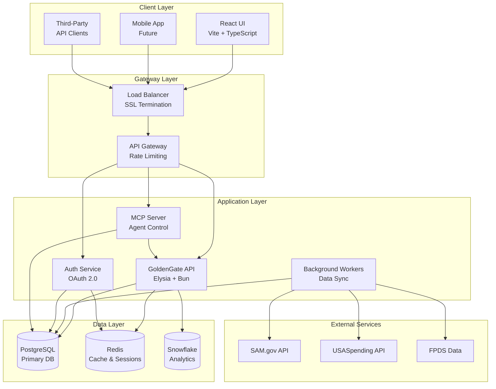

### Microservices Communication Flow

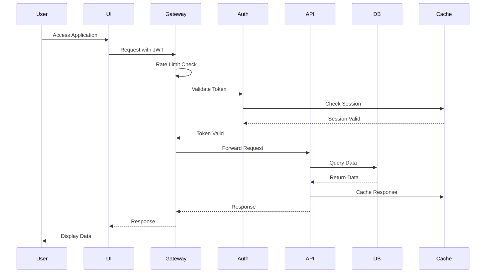

## Technology Stack

### Backend Stack

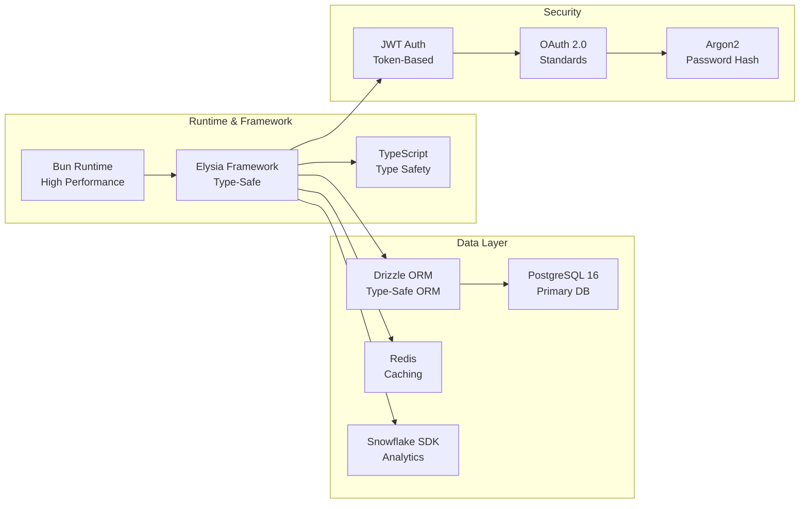

### Frontend Stack

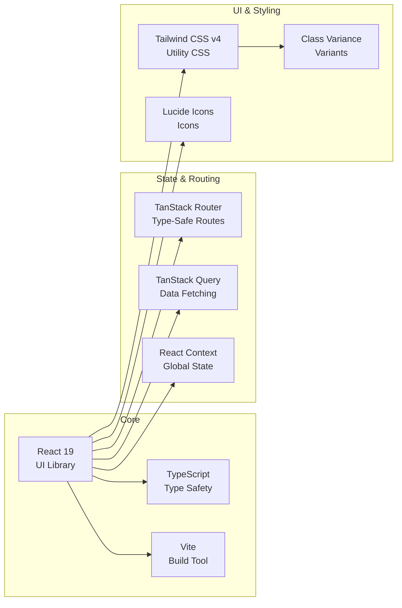

## API Architecture

### API Layer Structure

```mermaid
graph TD
    subgraph "API Server"
        Entry[index.ts<br/>Entry Point]
        
        subgraph "Middleware Stack"
            CORS[CORS Middleware]
            RateLimit[Rate Limiting]
            Auth_MW[Auth Middleware]
            Tenant[Tenant Resolution]
            RBAC[RBAC Middleware]
        end
        
        subgraph "Route Handlers"
            AuthRoutes[/auth/*<br/>Authentication]
            UserRoutes[/users/*<br/>User Management]
            ContractorRoutes[/contractors/*<br/>Contractor Data]
            ListRoutes[/contractor-lists/*<br/>Portfolio Mgmt]
            SnowflakeRoutes[/snowflake/*<br/>Analytics]
        end
        
        subgraph "Services"
            AuthService[Auth Service]
            ContractorService[Contractor Service]
            ListService[List Manager]
            SnowflakeService[Snowflake Query]
            ProfileAggregator[Profile Aggregator]
        end
        
        subgraph "Data Access"
            DrizzleORM[Drizzle ORM]
            QueryBuilder[Query Builder]
            CacheManager[Cache Manager]
        end
    end
    
    Entry --> CORS
    CORS --> RateLimit
    RateLimit --> Auth_MW
    Auth_MW --> Tenant
    Tenant --> RBAC
    
    RBAC --> AuthRoutes
    RBAC --> UserRoutes
    RBAC --> ContractorRoutes
    RBAC --> ListRoutes
    RBAC --> SnowflakeRoutes
    
    AuthRoutes --> AuthService
    UserRoutes --> AuthService
    ContractorRoutes --> ContractorService
    ListRoutes --> ListService
    SnowflakeRoutes --> SnowflakeService
    
    ContractorService --> ProfileAggregator
    
    AuthService --> DrizzleORM
    ContractorService --> DrizzleORM
    ListService --> DrizzleORM
    SnowflakeService --> QueryBuilder
    
    DrizzleORM --> CacheManager
    QueryBuilder --> CacheManager
```

### API Endpoint Categories

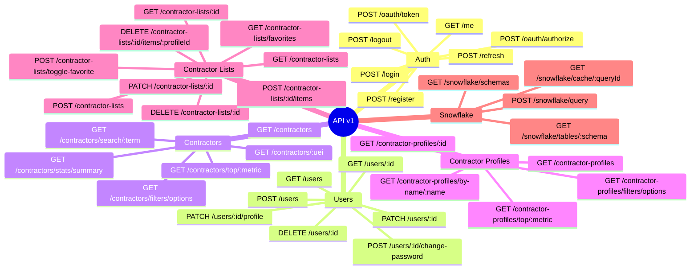

## Frontend Architecture

### Component Hierarchy

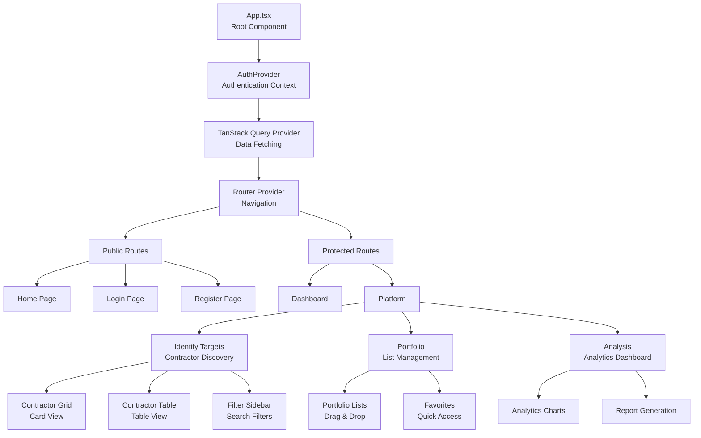

### State Management Flow

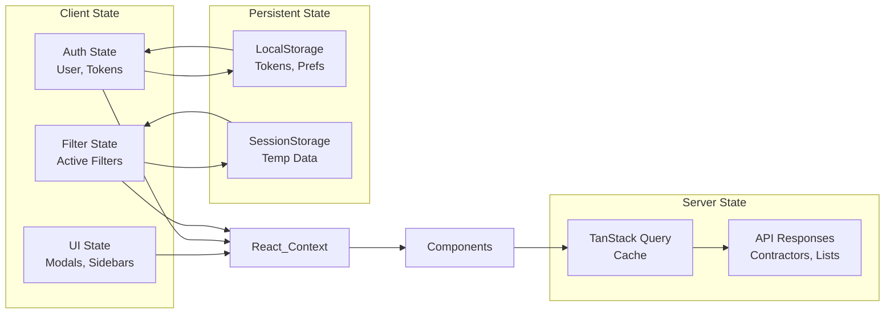

## Data Flow

### Contractor Data Pipeline

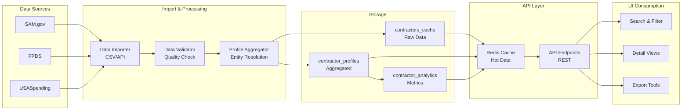

### Real-time Data Synchronization

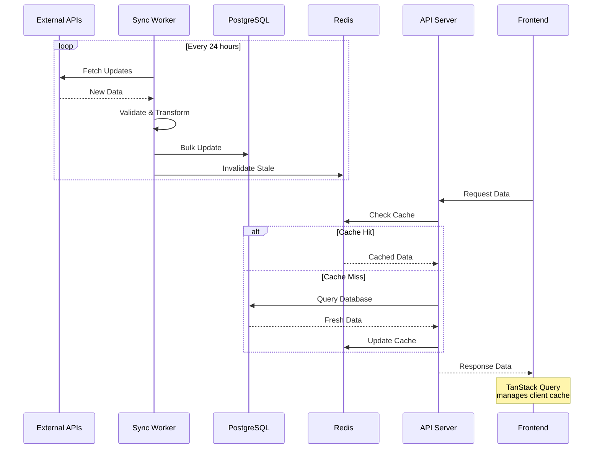

## Authentication & Security

### OAuth 2.0 Flow

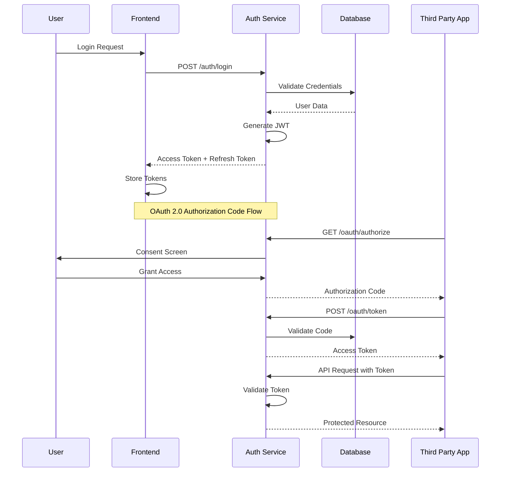

### RBAC Permission Matrix

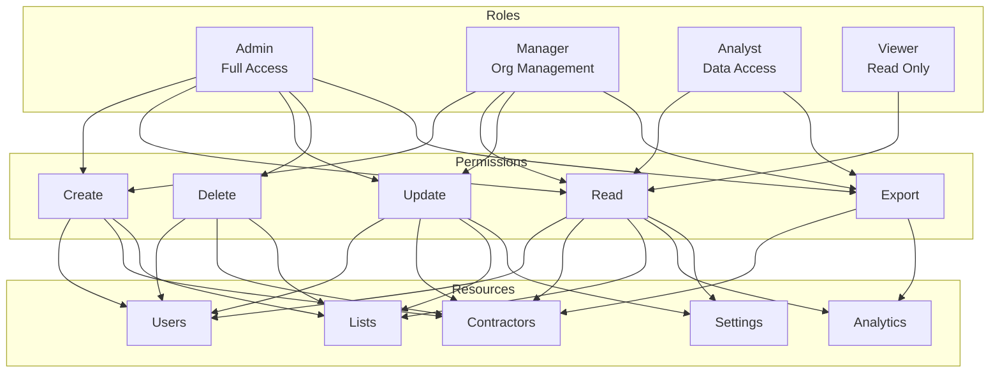

## Database Design

### Core Entity Relationships

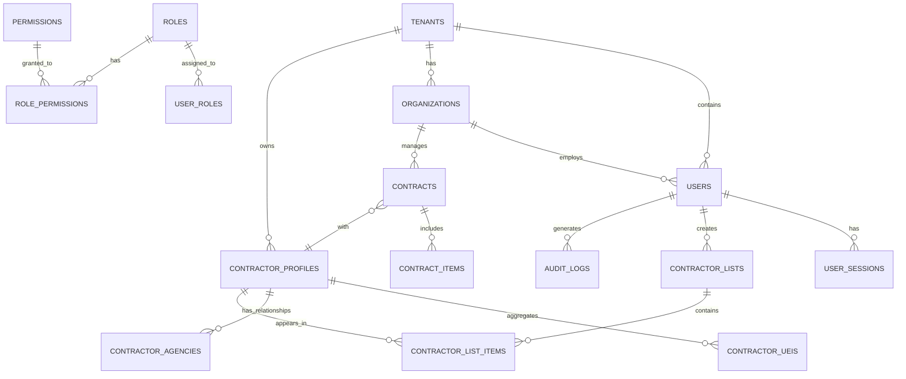

### Database Schema Layers

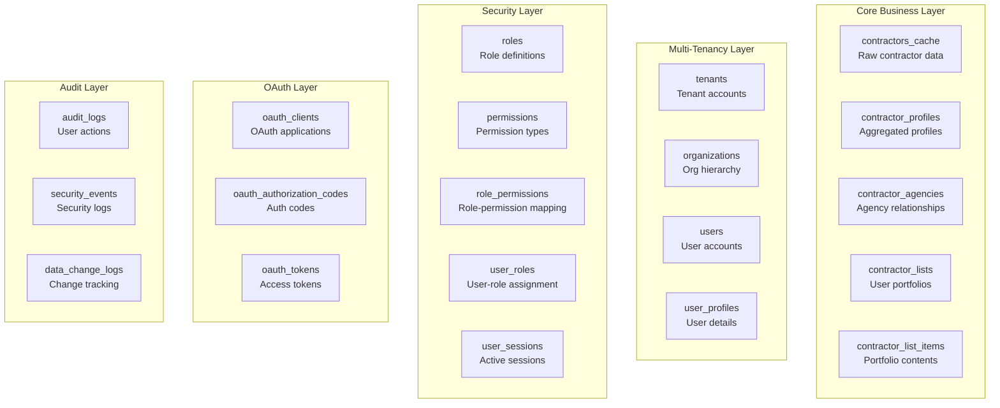

## Deployment Architecture

### Container Architecture

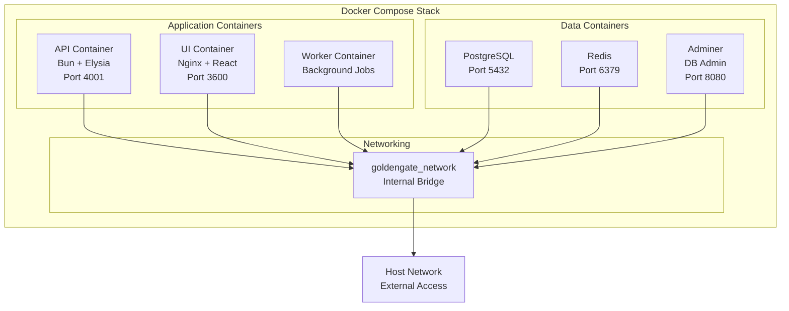

### Production Deployment

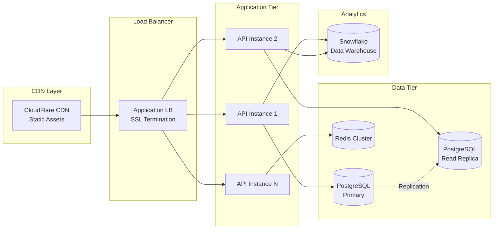

### CI/CD Pipeline

```mermaid
graph LR
    subgraph "Development"
        Dev[Developer<br/>Local Environment]
        Git[Git Push]
    end
    
    subgraph "CI Pipeline"
        GitHub[GitHub Actions]
        Tests[Run Tests<br/>Unit + Integration]
        Lint[Code Quality<br/>Biome + TypeScript]
        Build[Build Artifacts<br/>Docker Images]
    end
    
    subgraph "CD Pipeline"
        Registry[Container Registry<br/>ECR/Docker Hub]
        Staging[Staging Deploy<br/>Auto]
        Prod[Production Deploy<br/>Manual Approval]
    end
    
    subgraph "Monitoring"
        Logs[CloudWatch/DataDog]
        Metrics[Performance Metrics]
        Alerts[Alert Manager]
    end
    
    Dev --> Git
    Git --> GitHub
    GitHub --> Tests
    Tests --> Lint
    Lint --> Build
    Build --> Registry
    Registry --> Staging
    Staging --> Prod
    
    Staging --> Logs
    Prod --> Logs
    Logs --> Metrics
    Metrics --> Alerts
```

## Development Guide

### Local Development Setup

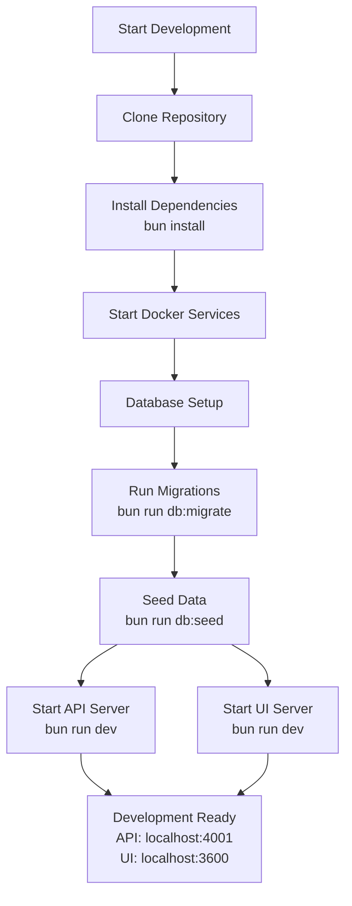

### Development Workflow

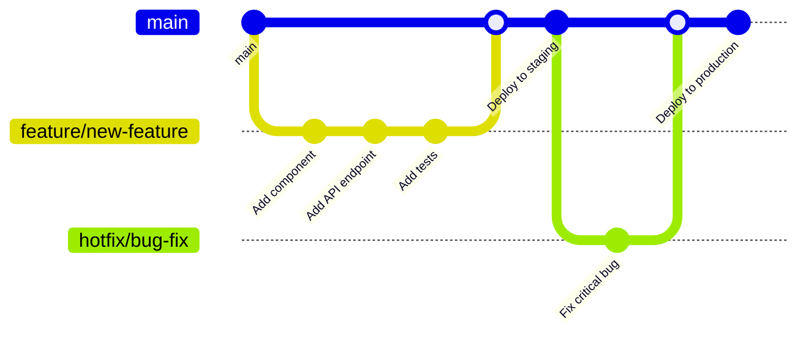

## API Documentation

### Request/Response Flow

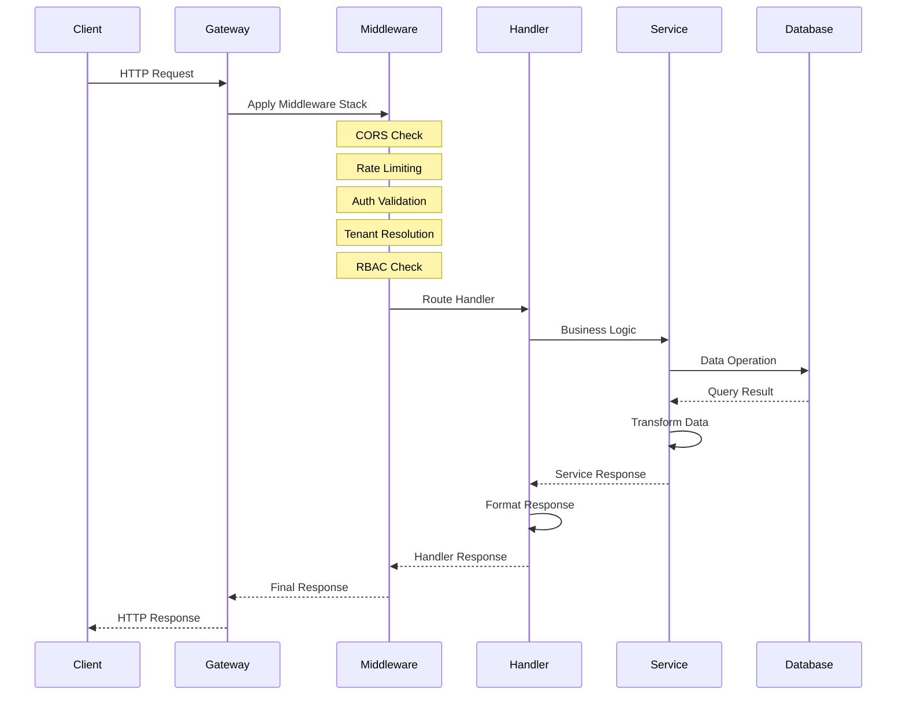

## Performance Optimization

### Caching Strategy

```mermaid
graph TD
    Request[API Request]
    
    Request --> L1{L1 Cache<br/>Memory}
    L1 -->|Hit| Response1[Return Data]
    L1 -->|Miss| L2{L2 Cache<br/>Redis}
    
    L2 -->|Hit| UpdateL1[Update L1]
    UpdateL1 --> Response2[Return Data]
    
    L2 -->|Miss| DB[(Database)]
    DB --> Transform[Transform Data]
    Transform --> UpdateL2[Update L2]
    UpdateL2 --> UpdateL1_2[Update L1]
    UpdateL1_2 --> Response3[Return Data]
    
    subgraph "Cache Invalidation"
        Write[Write Operation] --> InvalidateL1[Invalidate L1]
        Write --> InvalidateL2[Invalidate L2]
    end
```

## Monitoring & Observability

### Metrics Collection

```mermaid
graph LR
    subgraph "Application Metrics"
        API_Metrics[API Server<br/>Requests, Latency]
        UI_Metrics[Frontend<br/>Page Load, Errors]
        DB_Metrics[Database<br/>Queries, Connections]
    end
    
    subgraph "Infrastructure Metrics"
        CPU[CPU Usage]
        Memory[Memory Usage]
        Disk[Disk I/O]
        Network[Network I/O]
    end
    
    subgraph "Business Metrics"
        Users[Active Users]
        Contractors[Contractor Views]
        Lists[List Operations]
        Exports[Data Exports]
    end
    
    API_Metrics --> Collector[Metrics Collector<br/>Prometheus/DataDog]
    UI_Metrics --> Collector
    DB_Metrics --> Collector
    
    CPU --> Collector
    Memory --> Collector
    Disk --> Collector
    Network --> Collector
    
    Users --> Collector
    Contractors --> Collector
    Lists --> Collector
    Exports --> Collector
    
    Collector --> Dashboard[Monitoring Dashboard]
    Collector --> Alerts[Alert System]
```

## Available Documentation

| Document | Description | Location |
|----------|-------------|----------|
| Frontend Architecture | Complete frontend technical documentation | [FRONTEND_ARCHITECTURE.md](./FRONTEND_ARCHITECTURE.md) |
| API Documentation | Comprehensive API documentation | [apps/api/README.md](../apps/api/README.md) |
| Data Model | Complete database schema and ERDs | [apps/DATA_MODEL.md](../apps/DATA_MODEL.md) |
| Comprehensive Docs | Full platform documentation | [apps/COMPREHENSIVE_DOCUMENTATION.md](../apps/COMPREHENSIVE_DOCUMENTATION.md) |
| Frontend Integration | UI/API integration guide | [apps/FRONTEND_INTEGRATION.md](../apps/FRONTEND_INTEGRATION.md) |
| Bun Setup Guide | Bun, Elysia, Drizzle setup | [bun-elysia-drizzle-setup.md](./bun-elysia-drizzle-setup.md) |

## Quick Links

### Development
- **API Server**: http://localhost:4001
- **UI Application**: http://localhost:3600
- **API Documentation**: http://localhost:4001/docs
- **Database Admin**: http://localhost:8080
- **Drizzle Studio**: http://localhost:4983

### Resources
- [Bun Documentation](https://bun.sh/docs)
- [Elysia Documentation](https://elysiajs.com)
- [React Documentation](https://react.dev)
- [TanStack Documentation](https://tanstack.com)
- [Drizzle ORM Documentation](https://orm.drizzle.team)

## Support

For questions, issues, or contributions:
- Create an issue in the repository
- Contact the GoldenGate development team
- Review the contributing guidelines

---

*Last Updated: January 2025*  
*Version: 1.0.0*  
*© GoldenGate Platform - Midas Intelligence System*