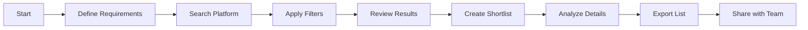

# GoldenGate Platform - User Guide

*A comprehensive guide for business users and administrators*

## 📖 Table of Contents

1. [What is GoldenGate?](#what-is-goldengate)
2. [Key Benefits](#key-benefits)
3. [Getting Started](#getting-started)
4. [Platform Features](#platform-features)
5. [How to Use the Platform](#how-to-use-the-platform)
6. [Common Workflows](#common-workflows)
7. [Troubleshooting](#troubleshooting)
8. [Frequently Asked Questions](#frequently-asked-questions)

---

## What is GoldenGate?

GoldenGate is an **Autonomous Intelligence Platform for Institutional Allocators** that helps organizations discover, analyze, and manage federal contractors. Think of it as your intelligent assistant for navigating the complex world of government contracting.

### In Simple Terms

Imagine having a super-smart assistant who:
- 🔍 **Knows every federal contractor** and their capabilities
- 📊 **Analyzes millions of contracts** to find patterns and opportunities
- 🎯 **Identifies the best matches** for your specific needs
- 📈 **Tracks performance and changes** in real-time
- 🤝 **Helps you build relationships** with the right contractors

That's GoldenGate - your AI-powered partner for federal contractor intelligence.

### Who Is This For?

- **Government Agencies** - Find and evaluate contractors for projects
- **Prime Contractors** - Identify subcontractors and partners
- **Investment Firms** - Analyze contractor performance and opportunities
- **Consultants** - Research market trends and competitive landscapes
- **Business Development Teams** - Discover partnership opportunities

---

## Key Benefits

### 🚀 Save Time
- **Hours to Minutes**: What used to take hours of research now takes minutes
- **Automated Updates**: Information is automatically refreshed daily
- **Smart Search**: Find exactly what you need without endless browsing

### 💡 Make Better Decisions
- **Data-Driven Insights**: Base decisions on comprehensive data analysis
- **Risk Assessment**: Understand contractor reliability and performance
- **Competitive Intelligence**: See the full competitive landscape

### 🎯 Find Hidden Opportunities
- **Discover New Contractors**: Find capable contractors you didn't know existed
- **Identify Trends**: Spot emerging opportunities before competitors
- **Partnership Potential**: Match contractors with complementary capabilities

### 📊 Comprehensive Coverage
- **All Federal Contractors**: Access data on every registered federal contractor
- **Historical Analysis**: View trends and patterns over time
- **Multi-Agency View**: See contractor relationships across all agencies

---

## Getting Started

### Prerequisites

Before you begin, you'll need:
1. **A Computer** with internet connection
2. **Web Browser** (Chrome, Firefox, Safari, or Edge)
3. **Basic Software**:
   - Docker Desktop (free download)
   - A text editor (like Notepad or TextEdit)

### Step 1: Install Docker Desktop

Docker is like a magic box that runs all the complex software for you.

#### For Windows Users:
1. Go to [Docker Desktop for Windows](https://www.docker.com/products/docker-desktop/)
2. Click "Download for Windows"
3. Run the installer (Docker Desktop Installer.exe)
4. Follow the installation wizard
5. Restart your computer when prompted

#### For Mac Users:
1. Go to [Docker Desktop for Mac](https://www.docker.com/products/docker-desktop/)
2. Click "Download for Mac"
3. Open the downloaded .dmg file
4. Drag Docker to your Applications folder
5. Open Docker from Applications

#### Verify Docker is Running:
- Look for the Docker whale icon in your system tray (Windows) or menu bar (Mac)
- The icon should be steady (not animated) when Docker is ready

### Step 2: Download GoldenGate

1. **Download the Project**
   - Visit the GoldenGate repository
   - Click the green "Code" button
   - Select "Download ZIP"
   - Extract the ZIP file to your Documents folder

2. **Open Terminal/Command Prompt**
   
   **Windows:**
   - Press `Windows Key + R`
   - Type `cmd` and press Enter
   
   **Mac:**
   - Press `Command + Space`
   - Type `Terminal` and press Enter

3. **Navigate to the Project**
   ```
   cd Documents/gg-mvp
   ```

### Step 3: Start the Platform

1. **Run the Setup Script**
   
   In your terminal, type:
   ```
   cd apps
   ./scripts/dev.sh setup
   ```
   
   This will:
   - Set up the database
   - Configure the system
   - Load sample data
   - Start all services

2. **Wait for Setup**
   - This may take 5-10 minutes the first time
   - You'll see messages as each component starts
   - When you see "Setup complete!", you're ready

3. **Start the Application**
   
   Open two terminal windows:
   
   **Terminal 1 - Start the API:**
   ```
   cd apps/api
   bun run dev
   ```
   
   **Terminal 2 - Start the UI:**
   ```
   cd apps/ui
   bun run dev
   ```

### Step 4: Access the Platform

1. **Open Your Web Browser**
2. **Go to:** http://localhost:3600
3. **You should see the GoldenGate login page!**

### Step 5: Create Your Account

1. Click **"Create Account"**
2. Fill in your information:
   - Email address
   - Username
   - Password (must be at least 8 characters)
   - Full name
3. Click **"Register"**
4. You'll be automatically logged in

---

## Platform Features

### 🔍 Identify Targets
Find and research federal contractors based on your specific criteria.

**What You Can Do:**
- Search by company name, location, or industry
- Filter by contract value, agency relationships, size
- View detailed contractor profiles
- See contract history and performance metrics
- Export contractor lists for further analysis

### 📁 Portfolio Management
Organize and track contractors you're interested in.

**What You Can Do:**
- Create custom lists (e.g., "Potential Partners", "Competitors")
- Add notes and tags to contractors
- Set priority levels and ratings
- Share lists with team members
- Track changes and updates

### 📊 Analysis Tools
Get insights and intelligence about contractors and markets.

**What You Can Do:**
- Compare multiple contractors side-by-side
- Analyze market trends and opportunities
- Generate reports and visualizations
- Track competitor movements
- Identify partnership opportunities

---

## How to Use the Platform

### Searching for Contractors

1. **Basic Search**
   - Click on "Identify Targets" from the main menu
   - Type a company name in the search box
   - Press Enter or click the search icon

2. **Advanced Filtering**
   - Click "Filters" on the left side
   - Select your criteria:
     - **Location**: Choose states or regions
     - **Industry**: Select business sectors
     - **Size**: Small, medium, or large businesses
     - **Contract Value**: Set minimum and maximum ranges
     - **Agency**: Filter by government agencies
   - Click "Apply Filters"

3. **Understanding Results**
   - Each contractor card shows:
     - Company name and location
     - Total contract value
     - Number of contracts
     - Primary agency relationships
     - Industry classification
   - Click on any card for detailed information

### Managing Your Portfolio

1. **Creating a List**
   - Go to "Portfolio" from the main menu
   - Click "Create New List"
   - Give your list a name (e.g., "Q1 2025 Prospects")
   - Add a description (optional)
   - Choose a color for easy identification
   - Click "Create"

2. **Adding Contractors to Lists**
   - When viewing contractors, click the star icon to add to favorites
   - Or click "Add to List" and select your target list
   - Add notes about why this contractor is important
   - Set priority (High, Medium, Low)

3. **Managing Lists**
   - Drag and drop to reorder contractors
   - Click the edit icon to update notes
   - Use tags to categorize (e.g., "verified", "contacted")
   - Export lists to Excel or CSV

### Analyzing Data

1. **Viewing Analytics**
   - Navigate to "Analysis" from the main menu
   - Select the type of analysis:
     - **Market Overview**: Industry trends and opportunities
     - **Competitor Analysis**: Compare similar contractors
     - **Agency Insights**: Understand agency spending patterns

2. **Creating Reports**
   - Choose contractors to include
   - Select metrics to analyze
   - Pick visualization type (charts, tables, maps)
   - Export as PDF or PowerPoint

---

## Common Workflows

### Workflow 1: Finding New Contractors for a Project



1. **Define what you need** (location, capabilities, size)
2. **Search the platform** using keywords
3. **Apply filters** to narrow results
4. **Review contractor profiles** for matches
5. **Add promising contractors** to a new list
6. **Analyze their performance** and history
7. **Export the list** for your team
8. **Share findings** in your next meeting

### Workflow 2: Monitoring Competitors

1. **Create a "Competitors" list** in your portfolio
2. **Add known competitors** using search
3. **Set up notifications** for changes (coming soon)
4. **Check weekly** for updates
5. **Analyze trends** in the Analysis section
6. **Generate monthly reports** for leadership

### Workflow 3: Due Diligence Research

1. **Search for the specific contractor**
2. **Review their complete profile**:
   - Contract history
   - Agency relationships
   - Performance metrics
   - Business classifications
3. **Check their peer group** for comparison
4. **Export detailed report** as PDF
5. **Add to "Under Review" list** with notes

---

## Troubleshooting

### Common Issues and Solutions

#### Platform Won't Start

**Problem**: When running the setup script, you get an error.

**Solutions**:
1. Make sure Docker Desktop is running (check for the whale icon)
2. Restart Docker Desktop
3. Try running the setup script again
4. If still not working, restart your computer

#### Can't Access the Website

**Problem**: Browser shows "Cannot connect" when going to localhost:3600

**Solutions**:
1. Check both terminal windows are running without errors
2. Wait 30 seconds and refresh the browser
3. Try a different browser
4. Check firewall isn't blocking the connection

#### Login Issues

**Problem**: Can't log in with your credentials

**Solutions**:
1. Check caps lock is off
2. Use the "Forgot Password" link (if available)
3. Try creating a new account
4. Clear browser cookies and cache

#### Slow Performance

**Problem**: Platform is running slowly

**Solutions**:
1. Close other applications to free up memory
2. Restart Docker Desktop
3. Clear browser cache
4. Reduce the number of search results displayed

#### Data Not Loading

**Problem**: Contractor data isn't showing up

**Solutions**:
1. Refresh the page
2. Check your internet connection
3. Log out and log back in
4. Restart the API server (Terminal 1)

### Getting Help

If you're still having issues:

1. **Check the Error Message**
   - Take a screenshot of any error messages
   - Note what you were doing when it happened

2. **Restart Everything**
   ```
   cd apps
   ./scripts/dev.sh restart
   ```

3. **Contact Support**
   - Email: support@goldengate.com
   - Include: Screenshots, error messages, and what you were trying to do

---

## Frequently Asked Questions

### General Questions

**Q: Is my data secure?**
A: Yes, GoldenGate uses enterprise-grade security including encryption, secure authentication, and role-based access control.

**Q: How often is the data updated?**
A: Contractor data is updated daily from official government sources.

**Q: Can multiple people use the same account?**
A: Each user should have their own account for security and audit purposes. Team features allow collaboration.

**Q: What browsers are supported?**
A: Chrome, Firefox, Safari, and Edge (latest versions).

### Features Questions

**Q: Can I export data to Excel?**
A: Yes, you can export search results and lists to CSV format, which opens in Excel.

**Q: Is there a limit to how many contractors I can save?**
A: No, you can create unlimited lists and save as many contractors as you need.

**Q: Can I share my lists with colleagues?**
A: Yes, lists can be made public or shared with specific team members.

**Q: Can I customize the filters?**
A: The platform provides comprehensive pre-built filters. Custom filters are on the roadmap.

### Technical Questions

**Q: Do I need to install anything besides Docker?**
A: You'll also need Bun (JavaScript runtime), but the setup script handles this for you.

**Q: Can I run this on a tablet?**
A: The web interface works on tablets, but you need a computer to run the server.

**Q: How much disk space do I need?**
A: At least 10GB free space for the application and database.

**Q: Can this run on older computers?**
A: Yes, but performance is better with at least 8GB RAM and a processor from the last 5 years.

### Data Questions

**Q: Where does the contractor data come from?**
A: Data is sourced from official government databases including SAM.gov, USAspending.gov, and FPDS.

**Q: How accurate is the information?**
A: We use official government sources and update daily. Data accuracy depends on government reporting.

**Q: Can I add my own contractor data?**
A: Currently, the platform uses official sources only. Custom data import is planned for future releases.

**Q: Is historical data available?**
A: Yes, the platform includes historical contract data for trend analysis.

---

## Tips for Success

### 🎯 Best Practices

1. **Start Simple**
   - Begin with basic searches before using advanced filters
   - Create one or two lists initially
   - Learn one feature at a time

2. **Organize Your Work**
   - Use descriptive names for lists
   - Add notes to explain why contractors are important
   - Use consistent tagging conventions

3. **Regular Updates**
   - Check your portfolio weekly
   - Update notes after contractor interactions
   - Export reports for important meetings

4. **Collaborate**
   - Share interesting findings with your team
   - Use the platform during meetings for live research
   - Export data for presentations

### 🚀 Power User Tips

- **Keyboard Shortcuts** (coming soon):
  - `Ctrl/Cmd + K`: Quick search
  - `Ctrl/Cmd + S`: Save current view
  - `Ctrl/Cmd + E`: Export data

- **Search Operators**:
  - Use quotes for exact matches: "Lockheed Martin"
  - Use AND/OR for complex searches
  - Use minus to exclude: aerospace -Boeing

- **Bulk Operations**:
  - Select multiple contractors with Shift+Click
  - Add multiple contractors to lists at once
  - Export selected contractors only

---

## Conclusion

GoldenGate transforms how you discover and analyze federal contractors. Whether you're finding new partners, monitoring competitors, or conducting due diligence, the platform provides the intelligence you need to make informed decisions.

### Next Steps

1. **Explore the Platform**: Spend 15 minutes clicking around
2. **Run a Test Search**: Look up contractors you already know
3. **Create Your First List**: Start with 5-10 contractors
4. **Generate a Report**: Try the export feature
5. **Share with Your Team**: Show them what you've discovered

### Remember

- The platform is designed to be intuitive - don't be afraid to explore
- Help is always available through the support channels
- Your feedback helps us improve the platform

---

## Appendix

### Glossary of Terms

- **UEI**: Unique Entity Identifier - the official ID for contractors
- **NAICS**: North American Industry Classification System - industry codes
- **Prime Contractor**: Main contractor working directly with the government
- **Subcontractor**: Company working under a prime contractor
- **Obligated Amount**: Money committed by the government
- **Set-Aside**: Contracts reserved for specific business types (small, minority-owned, etc.)

### Additional Resources

- [Federal Contracting Basics](https://www.sba.gov/federal-contracting)
- [Understanding NAICS Codes](https://www.naics.com/what-is-a-naics-code/)
- [SAM.gov Registration](https://sam.gov)

---

*Thank you for choosing GoldenGate. We're here to make federal contractor intelligence accessible and actionable for everyone.*

**Version 1.0 | Last Updated: January 2025**