# GoldenGate Platform - Visual Guide

Interactive diagrams and visual explanations of the GoldenGate platform architecture and workflows.

## 🏗️ Platform Overview

### Complete System Architecture

```mermaid
graph TB
    subgraph "Frontend Layer"
        UI[🎨 React UI<br/>Vite + TypeScript<br/>Port 3600]
        Mobile[📱 Mobile App<br/>Future Integration]
    end
    
    subgraph "API Gateway Layer"
        Gateway[🌐 API Gateway<br/>Rate Limiting<br/>Load Balancing]
        Auth[🔐 Auth Service<br/>OAuth 2.0<br/>JWT Tokens]
    end
    
    subgraph "Application Layer"
        API[🚀 GoldenGate API<br/>Bun + Elysia<br/>Port 4001]
        MCP[🤖 MCP Server<br/>AI Agent Control]
        ATF[⚡ Agent Taskflow<br/>User Agents]
        Worker[⚙️ Background Workers<br/>Data Sync]
    end
    
    subgraph "Data Layer"
        PG[🗄️ PostgreSQL<br/>Primary Database]
        Redis[📦 Redis<br/>Cache & Sessions]
        SF[❄️ Snowflake<br/>Analytics & DW]
    end
    
    subgraph "External APIs"
        SAM[🏛️ SAM.gov<br/>Contractor Data]
        FPDS[📋 FPDS<br/>Contract Data]
        USA[💰 USASpending<br/>Financial Data]
    end
    
    UI --> Gateway
    Mobile --> Gateway
    
    Gateway --> Auth
    Gateway --> API
    
    Auth --> PG
    Auth --> Redis
    
    API --> MCP
    API --> ATF
    API --> Worker
    API --> PG
    API --> Redis
    API --> SF
    
    Worker --> SAM
    Worker --> FPDS
    Worker --> USA
    
    classDef frontend fill:#61DAFB,stroke:#333,stroke-width:2px,color:#000
    classDef gateway fill:#FF9800,stroke:#333,stroke-width:2px,color:#fff
    classDef app fill:#4CAF50,stroke:#333,stroke-width:2px,color:#fff
    classDef data fill:#9C27B0,stroke:#333,stroke-width:2px,color:#fff
    classDef external fill:#F44336,stroke:#333,stroke-width:2px,color:#fff
    
    class UI,Mobile frontend
    class Gateway,Auth gateway
    class API,MCP,ATF,Worker app
    class PG,Redis,SF data
    class SAM,FPDS,USA external
```


### Multi-Tenant Architecture

```mermaid
graph TB
    subgraph "Tenant A - Defense Contractor"
        A_Users[👥 Users A]
        A_Data[📊 Contractor Data A]
        A_Lists[📋 Portfolio Lists A]
    end
    
    subgraph "Tenant B - Financial Services"
        B_Users[👥 Users B]
        B_Data[📊 Contractor Data B]
        B_Lists[📋 Portfolio Lists B]
    end
    
    subgraph "Shared Infrastructure"
        API_Layer[🚀 API Layer<br/>Multi-Tenant]
        Auth_Layer[🔐 Auth Layer<br/>Tenant Resolution]
        DB_Layer[🗄️ Database Layer<br/>Row-Level Security]
    end
    
    A_Users --> API_Layer
    B_Users --> API_Layer
    
    API_Layer --> Auth_Layer
    Auth_Layer --> DB_Layer
    
    DB_Layer --> A_Data
    DB_Layer --> B_Data
    DB_Layer --> A_Lists
    DB_Layer --> B_Lists
    
    classDef tenant fill:#2196F3,stroke:#333,stroke-width:2px,color:#fff
    classDef shared fill:#4CAF50,stroke:#333,stroke-width:2px,color:#fff
    
    class A_Users,A_Data,A_Lists,B_Users,B_Data,B_Lists tenant
    class API_Layer,Auth_Layer,DB_Layer shared
```


## 🔄 Application Workflows

### User Authentication Flow

```mermaid
sequenceDiagram
    participant User as 👤 User
    participant UI as 🎨 Frontend
    participant Auth as 🔐 Auth Service
    participant DB as 🗄️ Database
    participant API as 🚀 API Server
    
    User->>UI: Enter Credentials
    UI->>Auth: POST /auth/login
    Auth->>DB: Validate User
    DB-->>Auth: User Data + Tenant
    Auth->>Auth: Generate JWT
    Auth-->>UI: Access + Refresh Tokens
    UI->>UI: Store Tokens
    
    Note over UI: User authenticated
    
    UI->>API: Request with JWT
    API->>Auth: Validate Token
    Auth->>DB: Check Session
    DB-->>Auth: Session Valid
    Auth-->>API: User + Tenant Context
    API->>API: Apply RBAC
    API-->>UI: Protected Resource
```


### Contractor Discovery Workflow

```mermaid
flowchart TD
    Start[🔍 User Searches] --> Filters{Apply Filters?}
    
    Filters -->|Yes| ApplyFilters[⚙️ Apply Search Filters<br/>Industry, Size, Location<br/>Contract History]
    Filters -->|No| DirectQuery[📊 Direct Database Query]
    
    ApplyFilters --> QueryBuilder[🔧 Build Query<br/>Multi-table Joins<br/>Aggregations]
    DirectQuery --> QueryBuilder
    
    QueryBuilder --> Cache{Check Cache?}
    
    Cache -->|Hit| CachedResults[⚡ Return Cached Results<br/>Sub-second Response]
    Cache -->|Miss| Database[🗄️ Query PostgreSQL<br/>Complex Joins]
    
    Database --> Transform[🔄 Transform Data<br/>Aggregate Profiles<br/>Calculate Metrics]
    Transform --> UpdateCache[📦 Update Redis Cache<br/>TTL: 1 hour]
    UpdateCache --> Results[📋 Return Results]
    
    CachedResults --> Display[🎨 Display in UI<br/>Card/Table View]
    Results --> Display
    
    Display --> UserAction{User Action?}
    
    UserAction -->|View Details| DetailModal[📱 Contractor Detail<br/>Full Profile]
    UserAction -->|Add to List| AddToList[➕ Add to Portfolio<br/>List Management]
    UserAction -->|Export| Export[📤 Export Data<br/>CSV/Excel]
    UserAction -->|New Search| Start
    
    classDef user fill:#4CAF50,stroke:#333,stroke-width:2px,color:#fff
    classDef process fill:#2196F3,stroke:#333,stroke-width:2px,color:#fff
    classDef data fill:#9C27B0,stroke:#333,stroke-width:2px,color:#fff
    classDef ui fill:#FF9800,stroke:#333,stroke-width:2px,color:#fff
    
    class Start,UserAction user
    class ApplyFilters,QueryBuilder,Transform,UpdateCache process
    class Cache,Database,CachedResults,Results data
    class Display,DetailModal,AddToList,Export ui
```


### Data Synchronization Pipeline

```mermaid
graph LR
    subgraph "External Sources"
        SAM[🏛️ SAM.gov<br/>Entity Registrations]
        FPDS[📋 FPDS<br/>Contract Awards]
        USA[💰 USASpending<br/>Transaction Data]
    end
    
    subgraph "Ingestion Layer"
        Scheduler[⏰ Cron Scheduler<br/>Daily Sync]
        Workers[⚙️ Background Workers<br/>Parallel Processing]
        Validator[✅ Data Validator<br/>Quality Checks]
    end
    
    subgraph "Processing Layer"
        Transformer[🔄 Data Transformer<br/>Normalize & Clean]
        Aggregator[📊 Profile Aggregator<br/>Entity Resolution]
        Enricher[🔍 Data Enricher<br/>Industry Classification]
    end
    
    subgraph "Storage Layer"
        Cache_Raw[📦 Raw Data Cache<br/>contractors_cache]
        Profiles[👤 Contractor Profiles<br/>contractor_profiles]
        Analytics[📈 Analytics Tables<br/>Metrics & KPIs]
    end
    
    Scheduler --> Workers
    
    SAM --> Workers
    FPDS --> Workers
    USA --> Workers
    
    Workers --> Validator
    Validator --> Transformer
    Transformer --> Aggregator
    Aggregator --> Enricher
    
    Enricher --> Cache_Raw
    Enricher --> Profiles
    Enricher --> Analytics
    
    classDef external fill:#F44336,stroke:#333,stroke-width:2px,color:#fff
    classDef ingestion fill:#FF9800,stroke:#333,stroke-width:2px,color:#fff
    classDef processing fill:#2196F3,stroke:#333,stroke-width:2px,color:#fff
    classDef storage fill:#4CAF50,stroke:#333,stroke-width:2px,color:#fff
    
    class SAM,FPDS,USA external
    class Scheduler,Workers,Validator ingestion
    class Transformer,Aggregator,Enricher processing
    class Cache_Raw,Profiles,Analytics storage
```


## 🔐 Security Architecture

### Authentication & Authorization Flow


### Role-Based Access Control Matrix

```mermaid
graph TD
    subgraph "Roles"
        Admin[👑 Admin<br/>System Admin]
        Manager[👔 Manager<br/>Org Manager]
        Analyst[📊 Analyst<br/>Data Analyst]
        Viewer[👀 Viewer<br/>Read Only]
    end
    
    subgraph "Resources"
        Users[👥 Users]
        Contractors[🏢 Contractors]
        Lists[📋 Lists]
        Analytics[📈 Analytics]
        System[⚙️ System]
    end
    
    subgraph "Permissions"
        Create[➕ Create]
        Read[👁️ Read]
        Update[✏️ Update]
        Delete[🗑️ Delete]
        Export[📤 Export]
        Admin_P[🔧 Admin]
    end
    
    Admin --> Create
    Admin --> Read
    Admin --> Update
    Admin --> Delete
    Admin --> Export
    Admin --> Admin_P
    
    Manager --> Create
    Manager --> Read
    Manager --> Update
    Manager --> Export
    
    Analyst --> Read
    Analyst --> Export
    
    Viewer --> Read
    
    Create --> Users
    Create --> Lists
    
    Read --> Users
    Read --> Contractors
    Read --> Lists
    Read --> Analytics
    
    Update --> Users
    Update --> Lists
    
    Delete --> Lists
    
    Export --> Contractors
    Export --> Analytics
    
    Admin_P --> System
    
    classDef role fill:#2196F3,stroke:#333,stroke-width:2px,color:#fff
    classDef resource fill:#4CAF50,stroke:#333,stroke-width:2px,color:#fff
    classDef permission fill:#FF9800,stroke:#333,stroke-width:2px,color:#fff
    
    class Admin,Manager,Analyst,Viewer role
    class Users,Contractors,Lists,Analytics,System resource
    class Create,Read,Update,Delete,Export,Admin_P permission
```


## 📊 Data Architecture

### Database Schema Overview


### Data Flow Architecture


## 🚀 Development Workflows

### Local Development Setup

```mermaid
flowchart TD
    Start([👨‍💻 Start Development]) --> Clone[📥 Clone Repository]
    
    Clone --> Install[📦 Install Dependencies<br/>bun install]
    
    Install --> Docker[🐳 Start Docker Services<br/>./scripts/dev.sh setup]
    
    Docker --> Services{Services Running?}
    
    Services -->|❌ Failed| Debug[🔍 Debug Services<br/>Check ports & logs]
    Debug --> Docker
    
    Services -->|✅ Success| Database[🗄️ Setup Database<br/>Migrations & Seeds]
    
    Database --> StartAPI[🚀 Start API Server<br/>bun run dev]
    Database --> StartUI[🎨 Start UI Server<br/>cd ui && bun run dev]
    
    StartAPI --> APIReady[✅ API Ready<br/>localhost:4001]
    StartUI --> UIReady[✅ UI Ready<br/>localhost:3600]
    
    APIReady --> Development[🔧 Development Mode<br/>Hot Reload Active]
    UIReady --> Development
    
    Development --> Code[✍️ Write Code<br/>TypeScript + React]
    
    Code --> Test[🧪 Run Tests<br/>bun test]
    
    Test --> TestResult{Tests Pass?}
    
    TestResult -->|❌ Failed| Fix[🔧 Fix Issues]
    Fix --> Test
    
    TestResult -->|✅ Passed| Commit[💾 Commit Changes<br/>Git + CI/CD]
    
    classDef start fill:#4CAF50,stroke:#333,stroke-width:2px,color:#fff
    classDef process fill:#2196F3,stroke:#333,stroke-width:2px,color:#fff
    classDef decision fill:#FF9800,stroke:#333,stroke-width:2px,color:#fff
    classDef error fill:#F44336,stroke:#333,stroke-width:2px,color:#fff
    classDef success fill:#8BC34A,stroke:#333,stroke-width:2px,color:#fff
    
    class Start,Clone start
    class Install,Docker,Database,StartAPI,StartUI,Code,Test process
    class Services,TestResult decision
    class Debug,Fix error
    class APIReady,UIReady,Development,Commit success
```


### API Development Lifecycle

```mermaid
sequenceDiagram
    participant Dev as 👨‍💻 Developer
    participant Code as 📝 Code Editor
    participant API as 🚀 API Server
    participant DB as 🗄️ Database
    participant Test as 🧪 Test Suite
    participant CI as 🔄 CI/CD
    
    Dev->>Code: Write New Endpoint
    Code->>API: Auto-reload (Bun)
    API->>DB: Test Connection
    DB-->>API: Schema Validation
    
    Dev->>Test: Run Tests
    Test->>API: Endpoint Testing
    API-->>Test: Response Validation
    Test-->>Dev: Test Results
    
    alt Tests Pass
        Dev->>CI: Git Push
        CI->>CI: Run Full Test Suite
        CI->>CI: Type Checking
        CI->>CI: Build Validation
        CI-->>Dev: ✅ Success
    else Tests Fail
        CI-->>Dev: ❌ Failure Details
        Dev->>Code: Fix Issues
    end
    
    Note over Dev,CI: Continuous Development Loop
```


## 🔧 API Architecture

### Request Processing Pipeline


### API Endpoint Categories


## 💾 Caching Strategy

### Multi-Level Cache Architecture


## 🎯 Performance Monitoring

### Application Performance Dashboard

```mermaid
graph TB
    subgraph "API Metrics"
        ReqRate[📊 Request Rate<br/>Requests/sec]
        Latency[⏱️ Response Latency<br/>P95/P99 Times]
        ErrorRate[❌ Error Rate<br/>4xx/5xx Responses]
    end
    
    subgraph "Database Metrics"
        QueryTime[🗄️ Query Performance<br/>Slow Queries]
        Connections[🔗 Connection Pool<br/>Active/Idle]
        CacheHit[📦 Cache Hit Rate<br/>Redis Performance]
    end
    
    subgraph "Business Metrics"
        ActiveUsers[👥 Active Users<br/>Daily/Monthly]
        SearchRate[🔍 Search Activity<br/>Queries/min]
        ListOps[📋 List Operations<br/>Creates/Updates]
        Exports[📤 Data Exports<br/>Volume/Frequency]
    end
    
    subgraph "System Metrics"
        CPU[💻 CPU Usage<br/>Server Load]
        Memory[🧠 Memory Usage<br/>Heap/RSS]
        Disk[💾 Disk I/O<br/>Read/Write]
        Network[🌐 Network I/O<br/>Bandwidth]
    end
    
    subgraph "Alert Thresholds"
        HighLatency[⚠️ Response Time > 2s]
        HighError[🚨 Error Rate > 5%]
        LowCache[📉 Cache Hit < 80%]
        HighCPU[🔥 CPU > 80%]
    end
    
    ReqRate --> HighLatency
    Latency --> HighLatency
    ErrorRate --> HighError
    CacheHit --> LowCache
    CPU --> HighCPU
    
    classDef api fill:#2196F3,stroke:#333,stroke-width:2px,color:#fff
    classDef database fill:#4CAF50,stroke:#333,stroke-width:2px,color:#fff
    classDef business fill:#FF9800,stroke:#333,stroke-width:2px,color:#fff
    classDef system fill:#9C27B0,stroke:#333,stroke-width:2px,color:#fff
    classDef alerts fill:#F44336,stroke:#333,stroke-width:2px,color:#fff
    
    class ReqRate,Latency,ErrorRate api
    class QueryTime,Connections,CacheHit database
    class ActiveUsers,SearchRate,ListOps,Exports business
    class CPU,Memory,Disk,Network system
    class HighLatency,HighError,LowCache,HighCPU alerts
```


## 🔍 Quick Reference

### Development URLs
- **Frontend**: http://localhost:3600
- **API Server**: http://localhost:4001
- **API Health**: http://localhost:4001/health
- **Database Admin**: http://localhost:8080 (Adminer)
- **Drizzle Studio**: http://localhost:4983

### Common Commands
```bash
# Start development environment
./scripts/dev.sh setup

# API development
cd api
bun run dev              # Start API server
bun run db:migrate       # Run migrations
bun run db:studio        # Open DB admin
bun test                 # Run tests

# UI development
cd ui
bun run dev              # Start UI server
bun run build            # Build for production
bun run lint             # Check code quality
```

### Database Quick Access
```bash
# Connect to development database
./scripts/dev.sh db

# Connect to test database
./scripts/dev.sh db test

# View logs
./scripts/dev.sh logs postgres
./scripts/dev.sh logs redis
```

---

📊 **Interactive Diagrams**: All Mermaid charts are interactive when viewed in GitHub or compatible markdown viewers  
🔄 **Live Updates**: Diagrams reflect current platform architecture  
📱 **Mobile Friendly**: Optimized for viewing on all devices